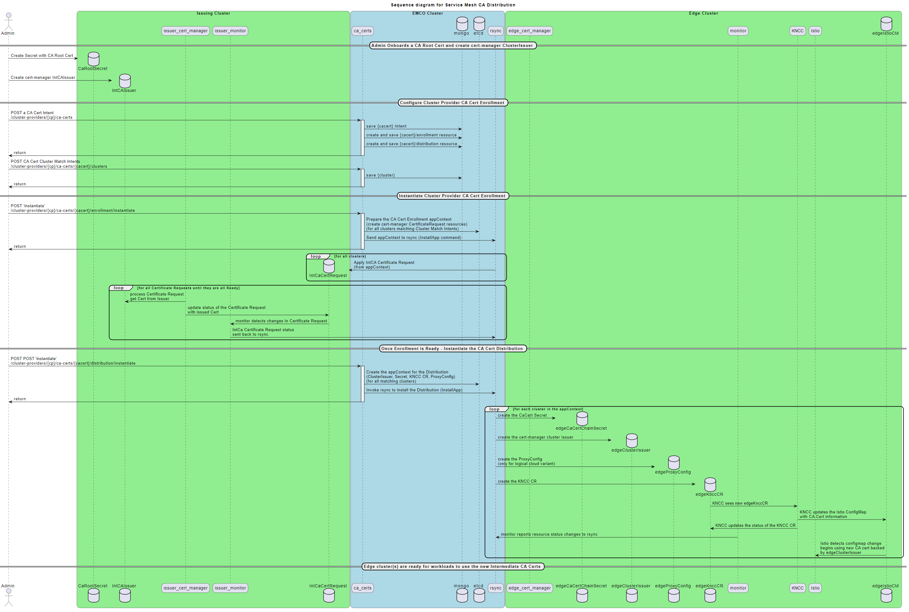

```
SPDX-License-Identifier: Apache-2.0
Copyright (c) 2022 Intel Corporation
```

# Overview of the `ca-certs` controller

The `ca-certs` controller will support an API that is exposed at two different points to provide two contexts (use cases) for enrolling and distributing common root CA certificates to a set of clusters.  The API is mostly common for both use cases.

The lifecycle of a given common Root CA set is performed in two steps.  The first step is `Enrollment` - which produces the set of common root intermediate CA certificates for each cluster that is selected to be part of the common Root CA set.  The second step is `Distribution` which deploys the prepared common root intermediate CA certificates to the corresponding clusters and causes them to be configured as either the default CA, or the CA for a set of namespaces in the Istio service mesh in each of the clusters.

## Use Case 1 - enroll and distribute common root CA certificates to a set of clusters.

These common root CA certificates will be used as the default CA of the cluster Istio.
(i.e. supports a single tenant concept)

### Intent APIs

1. `/v2/cluster-providers/{clusterProvider}/ca-certs/{caCert}` - endpoint for distributing common root CA certificates to a set of clusters associated with a Cluster Provider
1. `/v2/cluster-providers/{clusterProvider}/ca-certs/{caCert}/clusters/{cluster}` - endpoint for identifying how to identify which clusters are to be selected
   1. This resource identifies the `ClusterLabel` that is used identify which clusters are part of the set.  This design requires that the Admin has labelled the edge clusters (using `clm`) to indicate that the edge cluster satisfies the requirements to support this feature.  See the [CA Cert Example](../../examples/test-cert/Readme.md) for details on setting up the edge cluster.

### Enrollment lifecycle APIs
1. `/v2/cluster-providers/{clusterProvider}/ca-certs/{caCert}/enrollment/instantiate` - trigger the Enrollment process for a {caCert}
   1. This involves creating a cert-manager CertificateRequest for each cluster in the CA Set and applying it to a cluster (an Issuing Cluster) where a cert-manager ClusterIssuer has been set up by the Admin
   1. The status of the CertificateRequest will be monitored, and collected - via the EMCO `monitor`->`rsync` mechanism.
   1. When all CertificateRequests have been Issued, the Enrollment is `Ready`
   1. Note - the Issuing Cluster is any cluster which has been appropriately configured by the Admin and then onboarded to EMCO.  `rsync` will handles the Enrollment appContext just like any other EMCO appContext.
   1. Note - internally, an `Enrollment` resource will be added to the DB.   The primary reason is to have a DB resource in which to track the lifecycle attributes of the Enrollment (just like any other EMCO resource with lifecycles - `DeploymentIntentGroup`, `LogicalCloud`, `Cluster`).  There needs to be a resource to store the `StateInfo` data.
2. `/v2/cluster-providers/{clusterProvider}/ca-certs/{caCert}/enrollment/status` - query the status of a {caCert} `Enrollment` - the status will be `Ready` when all Intermediate CA Certificates have been Issued.
   1. It should be possible to enable the Status Notification framework with `Enrollment`
3. `/v2/cluster-providers/{clusterProvider}/ca-certs/{caCert}/enrollment/update` - after an initial `instantiate` the CA Set of clusters may have changed.  Perhaps other details have changed in the {caCert}
   1. Rsync will handle the `update` like other `update` procedures.  A new appContext is created, etc.
4. `/v2/cluster-providers/{clusterProvider}/ca-certs/{caCert}/enrollment/terminate` - terminate the Enrollment of a {caCert}

### Distribution lifecycle APIs
1. `/v2/cluster-providers/{clusterProvider}/ca-certs/{caCert}/distribution/instantiate` - trigger the deployment of the common root intermediate CA Certificates to all clusters in the CA Set
   1. As with the `Enrollment` resource, this will result in a `Distribution` resource - which is used to track and manage the appContext for the `Distribution` via the standard EMCO `StateInfo` method
   1. The appContext created for the `Distribution` is different than the appContext created for the `Enrollment` - hence two different resources are needed to manage them.
   1. Since `Distribution` occurs at some time after `Enrollment` occurs, it is conceivable that the set of clusters in the CA Set will be different.  The proposed method for handling this is to have `Distribution` Fail in this case with the direction to perform an `update` on the `Enrollment`, and then retry the `Distribution`.
   1. The `Enrollment` needs to be `Ready` before the `Distribution` can be instantiated.
   1. Note, the `Enrollment` and `Distribution` resources could be created automatically at the time of the {caCert} resource creation.
   1. `instantiate` will cause the creation of:
      1. `Secret` - holding the Intermediate CA Certificate, Key and Chain information
      1. cert-manger `ClusterIssuer` - which identifies the above `Secret` and other information
         1. consider the possibility that the Issuer backend could be something other than cert-manager.
         1. this information would need to be part of the above {caClusterMatch} resource (perhaps).  Could be a good reason to have that ability (caClusterMatch resources)
      1.  KNCC CR that identifies how to update the Istio ConfigMap in the cluster to use the new Intermediate CA certificate as the default CA
1. `/v2/cluster-providers/{clusterProvider}/ca-certs/{caCert}/distribution/status` - query the status of the {caCert} `Distribution`.  The status should be `Ready` once the `Secret` `ClusterIssuer` and KNCC CR resources are `Ready`.  Perhaps the KNCC CR will maintain some more detailed status attribute that will indicate if it is `Pending`, `Failed`, `Ready` or something.
   1. It should be possible to enable the Status Notification framework with `Enrollment`
   1. It should be possible to determine if the `Distribution` is behind the `Enrollment` - i.e. the `Enrollment` has been `updated`, but the `Distribution` has not been `updated` yet.
1. `/v2/cluster-providers/{clusterProvider}/ca-certs/{caCert}/distribution/update` - trigger an update of the Distribution of the common root intermediate CA Certificates to all clusters in the CA Set
   1. After `instantiation` of the Distribution, an `update` may have occurred in the `Enrollment`.  `update` on the `Distribution` will apply the changes to the clusters.
   1. Standard EMCO `rsync` update processing is expected to apply for this case.
1. `/v2/cluster-providers/{clusterProvider}/ca-certs/{caCert}/distribution/terminate` - terminates a `Distribution`
   1. `Secret`, `ClusterIssuer` and resources are removed
   1. What is done to the Istio ConfigMap since this is the default Istio CA? Answer: Deletion of the KNCC CR restores the previous configuration.


### Sequence diagram illustrating key elements of the flow

The following diagram illustrates the key flows of the design for the cluster provider variant.  The logical cloud variant is similar, with the addition of logical clouds needing to be created and the use of Istio `ProxyConfig` CRs to associate cert-manager signers
to specific namespaces (i.e. the namespaces of the logical clouds).

<!--
@startuml
skinparam roundcorner 20
title Sequence diagram for Service Mesh CA Distribution

actor Admin

box "Issuing Cluster" #LightGreen
database CaRootSecret
database IntCAIssuer
participant issuer_cert_manager
participant issuer_monitor
database IntCaCertRequest
end box

box "EMCO Cluster" #LightBlue
participant ca_certs
database mongo
database etcd
participant rsync
end box

box "Edge Cluster" #LightGreen
participant edge_cert_manager
database edgeCaCertChainSecret
database edgeClusterIssuer
database edgeProxyConfig
database edgeKnccCR
participant monitor
participant KNCC
participant Istio
database edgeIstioCM
end box

== Admin Onboards a CA Root Cert and create cert-manager ClusterIssuer ==
Admin -> CaRootSecret ** : Create Secret with CA Root Cert
Admin -> IntCAIssuer ** : Create cert-manager IntCAIssuer

== Configure Cluster Provider CA Cert Enrollment ==
Admin -> ca_certs ++ : POST a CA Cert Intent\n/cluster-providers/{cp}/ca-certs
ca_certs -> mongo : save {cacert} Intent
ca_certs -> mongo : create and save {cacert}/enrollment resource
ca_certs -> mongo : create and save {cacert}/distribution resource
ca_certs -> Admin -- : return

Admin -> ca_certs ++ : POST CA Cert Cluster Match Intents\n/cluster-providers/{cp}/ca-certs/{cacert}/clusters
ca_certs -> mongo : save {cluster}
ca_certs -> Admin -- : return

== Instantiate Cluster Provider CA Cert Enrollment ==
Admin -> ca_certs ++ : POST 'instantiate'\n/cluster-providers/{cp}/ca-certs/{cacert}/enrollment/instantiate
ca_certs -> etcd : Prepare the CA Cert Enrollment appContext\n(create cert-manager CertificateRequest resources)\n(for all clusters matching Cluster Match Intents)
ca_certs -> rsync : Send appContext to rsync (InstallApp command)
ca_certs -> Admin -- : return

loop for all clusters
rsync -> IntCaCertRequest ** : Apply IntCA Certificate Request\n(from appContext)
end loop


loop for all Certificate Requests until they are all Ready
issuer_cert_manager -> IntCAIssuer : process Certificate Request\nget Cert from Issuer
issuer_cert_manager -> IntCaCertRequest : update status of the Certificate Request\nwith issued Cert
IntCaCertRequest -> issuer_monitor : monitor detects changes in Certificate Request
issuer_monitor -> rsync : IntCa Certificate Request status\nsent back to rsync
end loop

== Once Enrollment is Ready - Instantiate the CA Cert Distribution ==
Admin -> ca_certs ++ : POST POST 'instantiate'\n/cluster-providers/{cp}/ca-certs/{cacert}/distribution/instantiate
ca_certs -> etcd : Create the appContext for the Distribution\n(ClusterIssuer, Secret, KNCC CR, ProxyConfig)\n(for all matching clusters)
ca_certs -> rsync : Invoke rsync to install the Distribution (InstallApp)
ca_certs -> Admin -- : return
loop for each cluster in the appContext
rsync -> edgeCaCertChainSecret ** : create the CaCert Secret
rsync -> edgeClusterIssuer ** : create the cert-manager cluster issuer
rsync -> edgeProxyConfig ** : create the ProxyConfig\n(only for logical cloud variant)
rsync -> edgeKnccCR ** : create the KNCC CR
edgeKnccCR -> KNCC : KNCC sees new edgeKnccCR
KNCC -> edgeIstioCM : KNCC updates the Istio ConfigMap\nwith CA Cert information
KNCC -> edgeKnccCR : KNCC updates the status of the KNCC CR
monitor -> rsync : monitor reports resource status changes to rsync
Istio <- edgeIstioCM : Istio detects configmap change\nbegins using new CA cert backed\nby edgeClusterIssuer
end loop

== Edge cluster(s) are ready for workloads to use the new Intermediate CA Certs ==

|||
@enduml
-->



## Use Case 2 - enroll and distribute common root CA certificates to a set of clusters belonging to a set of `Logical Clouds`.

These common root CA certificates will be used as the Istio CA for the Namespaces associated with the `Logical Clouds` in all of the Clusters.  This is in support of a multi-tenant concept.

### Intent APIs

1. `/v2/project/{project}/ca-certs/{caCert}` - endpoint for distributing common root CA certificates to a set of clusters associated with a Cluster Provider
2. `/v2/project/{project}/ca-certs/{caCert}/logical-clouds/{logicalCloud}` - endpoint to add logical clouds (and their matching clusters) to the CA Set
3. `/v2/project/{project}/ca-certs/{caCert}/logical-clouds/{logicalCloud}/clusters/{caClusterMatch}` - endpoint for identifying how to identify which clusters are to be selected from the logical-cloud
   1. This resource identifies the `ClusterLabel` that is used identify which clusters are part of the set.  This design requires that the Admin has labelled the edge clusters (using `clm`) to indicate that the edge cluster satisfies the requirements to support this feature.  See the [CA Cert Example](../../examples/test-cert/Readme.md) for details on setting up the edge cluster.


### Enrollment lifecycle APIs

1. `/v2/project/{project}/ca-certs/{caCert}/enrollment/instantiate` - trigger the Enrollment process for a {caCert}
   1. This will involve creating a cert-manager CertificateRequest for each cluster in the CA Set and applying it to a cluster where a cert-manager ClusterIssuer has been set up
   1. The status of the CertificateRequest will be monitored, and collected - via the EMCO `monitor`->`rsync` mechanism.
   1. When all CertificateRequests have been Issued, the Enrollment is `Ready`
2. `/v2/project/{project}/ca-certs/{caCert}/enrollment/status` - query the status of a {caCert} `Enrollment` - the status will be `Ready` when all Intermediate CA Certificates have been Issued.
   1. It should be possible to enable the Status Notification framework with `Enrollment`
3. `/v2/project/{project}/ca-certs/{caCert}/enrollment/update` - after an initial `instantiate` the CA Set of clusters may have changed, due to the addtion or deletion of Logical Clouds, or due to the set of Clusters in a given Logical Cloud.  Perhaps other details have changed in the {caCert}
   1. Rsync will handle the `update` like other `update` procedures.  A new appContext is created, etc.
4. `/v2/project/{project}/ca-certs/{caCert}/enrollment/terminate` - terminate the Enrollment of a {caCert}

### Distribution lifecycle APIs

1. `/v2/project/{project}/ca-certs/{caCert}/distribution/instantiate` - trigger the deployment of the common root intermediate CA Certificates to all clusters in the CA Set
   1. As with the `Enrollment` resource, this will result in a `Distribution` resource - which is used to track and manage the appContext for the `Distribution` via the standard EMCO `StateInfo` method
   1. The appContext created for the `Distribution` is different than the appContext created for the `Enrollment` - hence two different resources are needed to manage them.
   1. Since `Distribution` occurs at some time after `Enrollment` occurs, it is conceivable that set of clusters in the CA Set will be different.  The proposed method for handling this is to have `Distribution` Fail in this case with the direction to perform an `update` on the `Enrollment`, and then retry the `Distribution`.
   1. The `Enrollment` needs to be `Ready` before the `Distribution` can be instantiated.
   1. Note, the `Enrollment` and `Distribution` resources could be created automatically at the time of the {caCert} resource creation.
   1. `instantiate` will cause the creation of:
      1. `Secret` - holding the Intermediate CA Certificate, Key and Chain information
      1. cert-manager `ClusterIssuer` - which identifies the above `Secret` and other information
         1. consider possibility that the Issuer backend could be something other than cert-manager.  
         1. this information would need to be part of the above {caClusterMatch} resource (perhaps).  Could be a good reason to have that ability (caClusterMatch resources)
      1. KNCC CR that identifies how to update the Istio ConfigMap in the cluster to use the new Intermediate CA certificate(s) for a given cert-manager signer (i.e the ClusterIssuer)
      1. `ProxyConfig` resource - there could be multiple of these resources for a given Cluster - i.e. multiple Logical Clouds using the same {caCert}
2. `/v2/project/{project}/ca-certs/{caCert}/distribution/status` - query the status of the {caCert} `Distribution`.  The status should be `Ready` once the `Secret` `ClusterIssuer` and KNCC CR resources are `Ready`.  Perhaps the KNCC CR will maintain some more detailed status attribute that will indicate if it is `Pending`, `Failed`, `Ready` or something.
   1. It should be possible to enable the Status Notification framework with `Distribution`
   1. It should be possible to determine if the `Distribution` is behind the `Enrollment` - i.e. the `Enrollment` has been `updated`, but the `Distribution` has not been `updated` yet.
3. `/v2/project/{project}/ca-certs/{caCert}/distribution/update` - trigger an update of the Distribution of the common root intermediate CA Certificates to all clusters in the CA Set
   1. After `instantiation` of the Distribution, an `update` may have occurred in the `Enrollment`.  `update` on the `Distribution` will apply the changes to the clusters.
   1. Standard EMCO `rsync` update processing is expected to apply for this case.
4. `/v2/project/{project}/ca-certs/{caCert}/distribution/terminate` - terminates a `Distribution`
   1. `Secret`, `ClusterIssuer` and `ProxyConfig` and KNCC resources are removed


# Notes on Instantiation Sequence Details

This section provides more detailed notes on the steps taken during the instantiation of the `Enrollment` and `Distribution`.

## Use Case 1 - `ClusterProvider` based `CA Certs`

Details on steps to take for instantiating a `ClusterProvider` based `CA Certs` intent.

### `Enrollment` Instantiation

1. Find the `CA Cluster Set` for the given `ClusterProvider`
   1. Use the `CA Cluster Intents` to search for matching Clusters
   1. Each `CA Cluster Intent` will have one (or more) `Cluster Labels`  that identify Clusters
   1. If multiple `CA Cluster Intents` are supported - there may need to be additional information provided
1. Create AppContext
   1. Add an `App` to the `AppContext` - say, `Enrollment`
   1. Add the `Issuing Cluster` to the `AppContext`
1. For each cluster in the `CA Cluster Set`
   1. Prepare a cert-manager `CertificationRequest`
      1. Create a Private Key
      1. Use CA Cert Intent Template info to create a CSR
      1. Use the CSR and CA Cert Intent Template info to create a cert-manager `CertificateRequest`
         1. add this resource to the `AppContext`
      1. A naming convention for the `CertificateRequest` resources will be needed - including the `Cluster` name in the resource name should be sufficient.
1. `AppContext` is prepared - send InstallApp command to `rsync`
1. `monitor` in the `Issuing Cluster` will track status changes to the `CertificateRequest`
   1. which are updated back in the cluster `status` key of the `AppContext` by the `rsync` watcher
   1. Code needed to support determination of `CertificateRequest` is `Ready` and `Issued` (vs `Failed` or `Pending`)
   1. `CertificateRequest` needs to be added to set of resources monitored by `monitor`
1. Notes - in the course of the above sequence, two resources are created for each Cluster which need to be saved for use by the `Distribution` sequence:
   1. The Private Key
   1. The Issued Certificate
   1. The Private Key is created and saved during the `Enrollment` sequence
      1. A set of DB resources - keyed as:  `ClusterProvider`, `CaCert`, `Enrollment`, `Cluster`
         1. i.e. it is a child DB resource of `Enrollment` from Referential Schema perspective
   1. The Issued Certificate - will be retrieved from the `status` of the `CertificateRequest` and saved in DB
      1. A set of DB resources - keyed as: `ClusterProvider`, `CaCert`, `Enrollment`, `Cluster`
         1. child of `Enrollment`, sibling to Private Key
1. The Status Query and Status Notification framework is enabled for use with `Enrollment` - Status query is used to determine the `Enrollment` is `Ready`.

### `Distribution` Instantiation

1. Prerequisite - the Enrollment must be `Ready` - per above, checking status of all enrolled clusters could be done on demand at this point
1. Find all clusters of the `CA Cluster Set`
   1. Verify that all clusters in the set have been Issued
   1. Possible errors:
      1. some clusters are not Issued yet
         1. Try again later
      1. all clusters in `Enrollment` are Issued, but the `CA Cluster Set` now includes more clusters
         1. Enrollment needs to be `updated`
         1. Note: if some clusters been removed from the set, is `Enrollment` update required?
1. Prepare an `AppContext`
1. For each cluster in the `CA Cluster Set`
   1. Add the `Cluster` to the `AppContext`
   1. Create a `Secret` resource using the Issued Certificate data and Private Key
   1. Create a cert-manager `ClusterIssuer` resource referring to the `Secret`
   1. Create a KNCC CR resource with the Issued Certificate data for modifying the `istio ConfigMap`
1. `AppContext` is prepared - send `InstallApp` command to `rsync`
1. The Status Query and Status Notification framework can be enabled for use with `Distribution`

## Use Case 2 - `LogicalCloud` based `CA Certs`

Details on steps to take for instantiating a `LogicalCloud` based `CA Certs` intent.

### `Enrollment` Instantiation

1. Find the `CA Cluster Set`
   1. Find all `LogicalCloud` intents for the `CA Cert` intent
   1. Use the `CA Cluster Intents` to find all matching Clusters from all `Logical Clouds`
      1. `Logical Clouds` may have intersecting cluster sets, the resulting `CA Cluster Set` is a de-duplicated set of clusters
1. Create AppContext
   1. Add the `Issuing Cluster` to the `AppContext`
1. For each cluster in the `CA Cluster Set`
   1. Prepare a cert-manager `CertificationRequest`
      1. Create a Private Key
      1. Use CA Cert Intent Template info to create a CSR
      1. Use the CSR and CA Cert Intent Template info to create a cert-manager `CertificateRequest`
         1. add this resource to the `AppContext`
      1. A naming convention for the `CertificateRequest` resources will be needed - including elements like `Project`, `LogicalCloud` and `Cluster` name in the resource name may be necessary.
1. `AppContext` is prepared - send InstallApp command to `rsync`
1. `monitor` in the `Issuing Cluster` will track status changes to the `CertificateRequest`
   1. which are updated back in the cluster `status` key of the `AppContext` by the `rsync` watcher
   1. Code needed to support determination of `CertificateRequest` is `Ready` and `Issued` (vs `Failed` or `Pending`)
   1. `CertificateRequest` needs to be added to set of resources monitored by `monitor`
1. Notes - in the course of the above sequence, two resources are created for each Cluster which need to be saved for use by the `Distribution` sequence:
   1. The Private Key
   1. The Issued Certificate
1. Notes - when/which process is in charge of waiting for Issue Certificates?
   1. On demand - i.e. check at the time of `Distribution`, if `Not Ready`, then fail and try again later
1. The Status Query and Status Notification framework can be enabled for use with `Enrollment`

### `Distribution` Instantiation

1. Prerequisite - the Enrollment must be `Ready` - per above, checking status of all enrolled clusters could be done on demand at this point
1. Find all clusters of the `CA Cluster Set`
   1. Use the `LogicalCloud` intents to again create the `CA Cluster Set`
      1. Need to keep track of the `Namespaces` for each `Cluster` - i.e. some clusters may participate in multiple `LogicalClouds` which will use the same `CA Cert`
      1. Say, a `Map` keyed by `Cluster` with a value of List of `Namespaces`
   1. Verify that all clusters in the set have been Issued
   1. Possible errors:
      1. some clusters are not Issued yet
         1. Try again later
      1. all clusters in `Enrollment` are Issued, but the `CA Cluster Set` now includes more clusters
         1. Enrollment needs to be `updated`
         1. Note: if some clusters been removed from the set, is `Enrollment` update required?
1. Prepare an `AppContext`
1. For each cluster in the `CA Cluster Set`
   1. Add the `Cluster` to the `AppContext` - the following resources are created under the `Cluster`
   1. Create a `Secret` resource using the Issued Certificate data and Private Key
   1. Create a cert-manager `ClusterIssuer` resource referring to the `Secret`
   1. Create a KNCC CR resource with the Issued Certificate data for modifying the `istio ConfigMap` - associating the cert with the new cert signer (ClusterIssuer)
   1. For each `Namespace` associated with the `Cluster` (i.e. for each Logical Cloud in the CA Cert Intent that uses this cluster)
      1. Create an Istio `ProxyConfig` resource to identify the ClusterIssuer signer for this `Namespace`
1. `AppContext` is prepared - send `InstallApp` command to `rsync`
1. The Status Query and Status Notification framework can be enabled for use with `Distribution`
