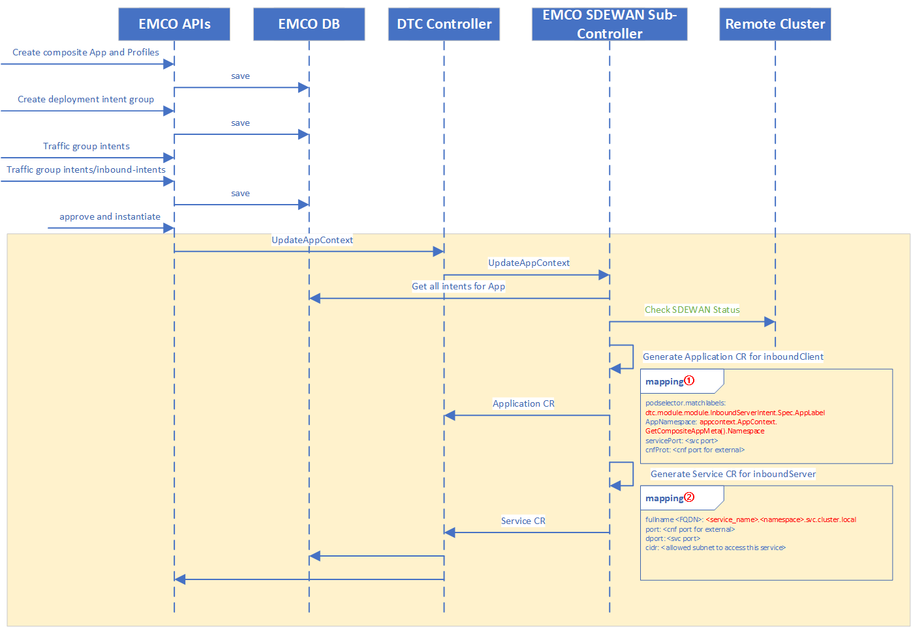
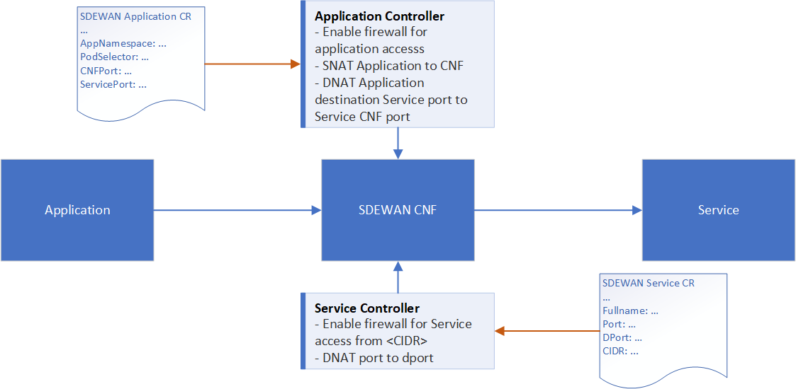

```
SPDX-License-Identifier: Apache-2.0
Copyright (c) 2022 Intel Corporation
```
# SDEWAN Setup with EMCO

When clusters are managed by EMCO, each cluster has its own SDEWAN CRD Controller and CNF installed, each CNF managed by its own SDEWAN controller. All of the clusters are under a shared administrative control of EMCO for the purposes of policy enforcement and security.

SD-EWAN functionalities are realized via CNF (Containerized Network Function) and deployed by K8s. SD-EWAN CNF leverages Linux kernel functionality for packet processing of above functions. Actual CNF is set of user space processes consisting of fw3, mwan3, strongswan and others.

SDEWAN CRD Controller and CNF can be installed easily using helm. And it depends on the [cert-manager](https://github.com/jetstack/cert-manager/releases/download/v1.8.2/cert-manager.yaml) CNI Network [ICN-Nodus](https://github.com/akraino-edge-stack/icn-nodus/blob/master/doc/how-to-use.md#testing-with-cni-proxy). To deploy SDEWAN CRD controller and CNF, you can refer to [SDEWAN](https://github.com/akraino-edge-stack/icn-sdwan).


## SDEWAN Deployment

SDEWAN CRD Controller and CNF installation on all clusters managed by EMCO is pre-requisite. EMCO doesn't install Sdewan but requires Sdewan CRD controller and CNF installations on each cluster as described in this section.

Kubernetes clusters with versions: 1.23.4

To deploy SDEWAN CRD Controller and CNF, we need to pre-install cert-manager and icn-nodus together with multus which define calico as the default Kubernetes network cni. And we can refer to [here](https://github.com/akraino-edge-stack/icn-sdwan/tree/master/platform/deployment) to deploy SDEWAN into your kubernetes cluster.

## SDEWAN CRD Controller and CNF installation

**1.Create namespace for SDEWAN Central Controller v1 Micro-services**

`kubectl create namespace sdewan-system`

**2.Clone and locate to SDEWAN helm**

```shell
git clone https://github.com/akraino-edge-stack/icn-sdwan.git
cd icn-sdwan/platform/deployment/helm
```

**3.Generate certificate for cnf**

`kubectl apply -f cert/cnf_cert.yaml`

**4.Install CNF**

```shell
helm package sdewan_cnf
helm install ./cnf-0.1.0.tgz --generate-name
```

**5.Install CRD controller**

```shell
helm package sdewan_controllers
helm install ./controllers-0.1.0.tgz --generate-name
```

## Workflow of the DTC SDEWAN sub controller



## Design of SDEWAN Application and Service CR



In SDEWAN, we have defined two CRs based on Kubernetes CRD, SDEWAN application and SDEWAN service. 

SDEWAN application is used to generate traffic forward rule, firewall enabled rule to the application behind SDEWAN CNF. When the SDEWAN application CR is deployed, SDEWAN CRD Controller will reconcile the resources and apply the generated rules into SDEWAN CNF with enabling the accession to specified service for application and forward the request to SDEWAN CNF to get further procession.

SDEWAN service is used to generate traffic forward rule, firewall enabled rule for the services deployed together with SDEWAN CNF. When the SDEWAN Service CR is provisioned into Kubernetes cluster, the SDEWAN CRD controller for services will check the FQDN of the service and generate network accession for the CIDR defined in CR to service. It also forwards the requests to specified CNF port to the real service.