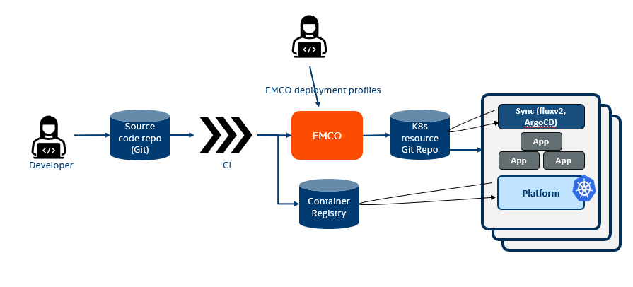

```text
SPDX-License-Identifier: Apache-2.0
Copyright (c) 2020-2021 Intel Corporation
```
<!-- omit in toc -->
# GitOps Support in EMCO

## Introduction and Motivation

GitOps is a way to do Kubernetes cluster management and application delivery.  GitOps works by using Git as a single source of truth for declarative infrastructure and applications. With GitOps, the use of software agents can alert on any divergence between Git with what's running in a cluster, and if there's a difference, Kubernetes reconcilers automatically update or rollback the cluster depending on the case. With Git at the center of your delivery pipelines, developers use familiar tools to make pull requests to accelerate and simplify both application deployments and operations tasks to Kubernetes.
With GitOps you use the Git version control system to organize and manage your infrastructure just like any other codebase. It’s an excellent model for applications deployed as containers and pods on Kubernetes.
[WeaveNetworks blog on GitOps](https://www.weave.works/technologies/gitops/).


### [Refer to this Linkedin Article for complete explaination on Complementing GitOps with EMCO](https://www.linkedin.com/pulse/complementing-google-anthosmicrosoft-arcaws-gitops-emco-addepalli/)

All public cloud providers implement GitOps way of deploying applications in the managed K8s clusters. The expectation is that some CI/CD or users write all application K8s resources to be deployed in a git repository. The sync agent (normally fluxv2 or ArgoCD) in each cluster discovers new resources to be synchronized by reading the git repository and applying them locally by talking to the local K8s API server.

It is all good for simple applications and uniform K8s clusters. For geo-distributed applications, edge computing, there are few additional requirements.

* On-demand instantiation of applications on K8s clusters: One may not like to deploy applications in all possible edges all the time. What is the point of deploying applications when there are no users nearby? So, there shall be some intelligent entity that makes decisions on when to place the workloads.

* Intelligent selection of clusters to place the workloads: If there are choices of K8s clusters to place the workload on, some intelligent entity needs to select the right K8s clusters. Criteria to select could be based on capabilities of the cluster, based on the cost of placing workload on the clusters, based on distance of the cluster from
users, based on the resources availability of clusters and even can be based on the amount of green gas energies that clusters emit.
* On-demand scale-out (bursting) of the applications: There may be a need to bring up parts of the application in other clusters to take up the load. Again, some intelligent entity needs to make a decision on scale-out and scale-in based to meet SLAs.

* Customization of resources to the applications: When an application is duplicated across multiple clusters, it is not always true that all K8s resources are exactly the same. In some cases, some microservices may need to be assigned with different CPU resources than when deployed in different clusters. Any customization that is required based on cluster types requires some intelligent entity taking intents and applying them to the K8s resources.

* Automation of service mesh and other connectivity & security infrastructure: Some K8s resources that need to be added are based on the type of infrastructure they have. For intra and inter application communication within a cluster or across clusters require some additional automation related to service mesh (such as ISTIO/Envoy), firewalls, NAT and others. Hence, there is a need for some intelligent entity that automates these entities by creating new K8s resources based on the type of infrastructure that is there at each cluster.

* Dependency and order of priority of application deployments: It is observed that in few cases, there are dependency challenges. Some microservices may not start well if they are brought up before other microservices. To support these dependencies, one shall have an intelligent entity that understands these dependencies and prime the git repositories with resources at the right time. As an example, if X depends on Y to be up and running, then X specific resources are expected to be primed in the git repository only after Y status is 'ready'.


_EMCO and GitOps_




## Design

Flux CD and Argo CD, are two Kubernetes-native applications that facilitate and help enforce GitOps pattern. Additionaly, Azure supports GitOps on an Azure Arc-enabled Kubernetes cluster and GoogleCloud with Anthos. EMCO integration with GitOps aims to support various vendors and technologies with an extensible design.

Currently, EMCO supports deploying resources on a Kubernetes cluster directly and also interacts directly with a Kubernetes cluster to get the status of the deployed resources. With this support EMCO will add support for clusters that support GitOps.

### Terminology:

* Resources Sync - This is actual applying of the resources for a cluster. In default case this is interacting directly with the K8s cluster. In case of GitOps it is writting into a Git location. To begin with Github and Gitlab locations will be supported.

* Resources Reference - This is the configuration that needs to be applied for the cluster based on type of the GitOps support on the cluster. For example in case of FluxCD this will be the configuration for the Git Repositories and in case of Azure Arc it will be providing `config` to Azure Arc.

* Control Git - Control Git is a Git repository that is used for 2 purposes:
  1.  Manage the GitOps provider itself in some cases. For example in case of Flux based Kubernetes cluster, Flux will be configured to manage itself from the control Git.
  2. Store EMCO Monitor status CR read from the target cluster.  Monitor CR records the status of the resources deployed by EMCO on the cluster. In default case, EMCO watches for CR changes and reads it from the cluster. In case of GitOps control Git will be used by the Monitor to store CR in the control Git on any change in the CR. EMCO will watch the control Git to watch for changes to the Monitor CR's.


Various combinations that will be supported:

| Resources Sync      | Resources Reference     | Status CR | Comments  |
| ------------- |:-------------|:-----|:-----|
| K8s           | K8s           | K8s   | Current Implementation     |
| GitOps(Github, Gitlab)      | Cloud Provider       |   Control Git | ex Azure Arc and Google Anthos |
| GitOps(Github, Gitlab)      | Flux CD         |   Control Git |  |
| GitOps(Github, Gitlab)      | Argo CD         |   Control Git |  |


## Cluster API update for GitOps

Currently EMCO assumes that all clusters are directly accessible from EMCO using the Kubernetes configuration.
The cluster API's needs to be extended to add support for GitOps based providers.

### Cluster Sync Objects API

An API called cluster-sync-objects is added to allow users to provide key value pairs to give credentials for different cloud providers and also Git credentials. This API provides an array of key value pairs that can be used to provide credentials for any kind of provider. The key value pairs are created based on requirement and are not fixed in the API.

### Request

`Post v2/cluster-provider/{cluster-provider}/cluster-sync-objects/`

```json
{
    "metadata": {
    "name": "ObjectName"
  },
  "spec": {
    "kv": [
      {
        "additionalProp1": "string",
        "additionalProp2": "string",
        "additionalProp3": "string"
      }
    ]
  }
}

```
Example of a GitOps Cluster Sync object for the above API:

```json
{
    "metadata": {
    "name": "GitObjectMyRepo"
  },
  "spec": {
    "kv": [
      {
        "gitType": "github",
        "user": "user1",
        "token": "xxx_abfc",
        "repoUrl": "https://github.com/org1/myRepo", // Can we just have the repo name
        "branch": "main"
      }
    ]
  }
}
```

Example of a Azure Arc Object Cluster Sync object for the above API:

```json
{
    "metadata": {
    "name": "AzureReferenceObject"
  },
  "spec": {
    "kv": [
      {
        "clientID": "xyz",
        "tenantID": "tenant1",
        "clientSecret": "xxx_abfc",
        "subscriptionID": "abc",
        "arcResourceGroup": "xyz",
      }
    ]
  }
}
```

### Changes to cluster registration API

Existing cluster registration API takes in a kubeconfig file for accessing a cluster directly. The API is extended to add 3 fields under gitOps section in spec. If gitOps section is provided than all 3 fields are mandatory. If this section is omitted than that is the default case and behaviour of the API doesn't change from the existing API.

- gitOpsType: This specifies the provider of GitOps. Examples are Azure Arc, Google Anthos, FluxCD, and ArgoCD.
    - Fixed values will be "azureArc", "fluxv2", "anthos".

- gitOpsReferenceObject: This is the cluster-sync-object for providing credentials for the gitOps provider.

- gitOpsResourceObject: This is the cluster-sync-object for providing credentials for the git repo to be used for this cluster. EMCO will create a directory in the repo clusters/{provider-name}+{cluster-name} and store the resources under context directory and status under status directory.(See below for details on directory structure)

### Example Request with Azure Arc as GitOps provider

`Post v2/cluster-provider/{cluster-provider}/clusters`

```json
{
    "metadata": {
    "name": "cluster1",
    "description": "Resource description",
    "userData1": "Some data",
    "userData2": "Some more data"
  },
  "spec": {
    "gitOps": {
      "gitOpsType": "azureArc",
      "gitOpsReferenceObject": "AzureReferenceObject",
      "gitOpsResourceObject": "GitObjectMyRepo"
    }
  }
}
```

### Example Request with Fluxv2 as GitOps provider

`Post v2/cluster-provider/{cluster-provider}/clusters`

```json
{
    "metadata": {
    "name": "cluster1",
    "description": "Resource description",
    "userData1": "Some data",
    "userData2": "Some more data"
  },
  "spec": {
    "gitOps": {
      "gitOpsType": "fluxv2",
      "gitOpsReferenceObject": "GitObjectMyRepo",
      "gitOpsResourceObject": "GitObjectMyRepo"
    }
  }
}

```

### Git directory structure

In case of GitOps the resources will be placed in the Git repo provided during the cluster registration.
The structure of Git directory for an application being deployed will be decided by EMCO.

The following example shows how the directories will be setup by EMCO.
The directories structure to store application specific resources will be:

  - clusters/{Cluster name}/context/{AppContext ID}/app/{App Name}

The directories structure to store status resources will be:

  - clusters/{Cluster name}/status/{AppContext ID}/

#### Example directory structure with Fluxv2

```
github.com/emco/
├── clusters
│   ├── provider1+cluster1
│   │   ├── 2175235486952720473-kcust-ns.yaml
│   │   ├── 2175235486952720473-kcust.yaml
│   │   ├── 2175235486952720473-source-ns.yaml
│   │   ├── 2175235486952720473-source.yaml
│   │   ├── context
│   │   │   └── 2175235486952720473
│   │   │       └── app
│   │   │           ├── firewall
│   │   │           │   ├── firewall-service.yaml
│   │   │           │   └── firewall.yaml
│   │   │           └── redis
│   │   │               ├── redis-service.yaml
│   │   │               └── redis.yaml
│   │   ├── flux-system
│   │   │   ├── gotk-components.yaml
│   │   │   ├── gotk-sync.yaml
│   │   │   └── kustomization.yaml
│   │   └── status
│   │       └── 2175235486952720473
│   │   │       └── app
│   │   │           ├── firewall
│   │                   ├── 2175235486952720473-firewall-status.yaml
│   │  
│   └── provider1+cluster2
│       ├── flux-system
│       │   ├── gotk-components.yaml
│       │   ├── gotk-sync.yaml
│       │   └── kustomization.yaml
│       ├── pod-Kcust.yaml
│       └── pod-source.yaml
└── README.md

```

### Logical Cloud Support

In EMCO Logical Cloud is a grouping of one or many clusters to create multi-tenancy at cluster level. A Logical Cloud groups many clusters together but a cluster may also be grouped by multiple Logical Clouds, effectively turning the cluster multi-tenant. This is achieved via the creation of distinct, isolated namespaces in each of the Kubernetes clusters that make up the Logical Cloud.

With GitOps different providers have different ways of achieving multi-tenancy.

#### Flux v2

Flux manages tenants by assigning namespaces, service accounts and role binding to the tenant's apps. During logical cloud creation all the required resources including service account, namespace, roles and rolebindings are created on all the clusters that are part of the Logical Cloud. At the time of application deployment by EMCO, Flux "Kustomization" resource is populated with the related namespace and service account values.

Reference: https://github.com/fluxcd/flux2-multi-tenancy

#### Azure Arc

As Azure Arc is based on Flux so all Flux principles apply to Azure Arc also. Apart from creating logical cloud resources as in Flux case, at the time of application deployment in Azure arc the configuration is created with "Namespace" scope. (as opposed to "Cluster" scope). This configuration is taken care by the Azure Arc plugin in EMCO.

Reference: https://docs.microsoft.com/en-us/azure/azure-arc/kubernetes/tutorial-use-gitops-flux2#multi-tenancy

### Flux v2 Setup

Install flux using the fluxctl instructions. (https://fluxcd.io/docs/installation/#github-and-github-enterprise). Provide the name of the cluster to be providername+clustername format. For example in the following example the provider name registered with EMCO is provider1flux and the cluster name registerd with EMCO is cluster2.

```
$ flux bootstrap github --owner=$OWNER --repository=$REPO --branch=main --path=./clusters/provider1flux+cluster2 --personal
```

On the edge cluster that supports Flux v2 install monitor like the example below. Note the name of the cluster. That name should match the name provided above.

```
$ cd emco-base/deployments/helm/monitor
```
```
$ helm  install --kubeconfig $KUBE_PATH  --set git.token=$GITHUB_TOKEN --set git.repo=SREPO --set git.username=$OWNER --set git.clustername="provider1flux+cluster2" --set git.enabled=true  -n emco monitor .
```

Follow the example below to install and monitor an application on Fluxv2 based cluster and a regular direct access cluster

https://gitlab.com/project-emco/core/emco-base/-/tree/main/examples/test-flux

export $GITHUB_USER, $GITHUB_TOKEN, $GITHUB_REPO and $KUBE_PATH1 and run setup.sh create script.

### Azure Arc Setup

#### Obtaining credentials to access Azure account

- We obtain access to the Azure account by registering an app to the account. Follow the steps mentioned here https://docs.microsoft.com/en-us/azure/active-directory/develop/quickstart-register-app#register-an-application to register an app and obtain the client ID and tenant ID.
- To secure the access we also need a client secret. Follow the steps mentioned here https://docs.microsoft.com/en-us/azure/active-directory/develop/quickstart-register-app#add-a-client-secret
to create a client secret.
- Note down these client ID, tenant ID, client secret as well as the subscription ID.

#### Creating Azure Arc Cluster

- Follow the steps mentioned here https://docs.microsoft.com/en-us/azure/azure-arc/kubernetes/quickstart-connect-cluster?tabs=azure-cli to connect your Kubernetes cluster to Azure Arc.
- To install the required prerequisites follow the steps mentioned here https://docs.microsoft.com/en-us/azure/azure-arc/kubernetes/tutorial-use-gitops-flux2#prerequisites and here https://docs.microsoft.com/en-us/azure/azure-arc/kubernetes/tutorial-use-gitops-flux2#enable-cli-extensions.
- Note down the Azure resource group name and Azure Arc cluster name that you used while connecting your Kubernetes cluster to Azure Arc.

#### Installing Monitor

Follow steps mentioned below

```
$ git clone https://gitlab.com/project-emco/core/emco-base.git
```

```
$ cd emco-base/deployments/helm/monitor/templates
```

Update the secret.yaml with git username, git token, git repo name, and clustername. Ensure that the values are base64 encoded.

```
apiVersion: v1
kind: Secret
metadata:
  name: {{ .Release.Name }}-git-monitor
  namespace: {{ .Release.Namespace }}
type: Opaque
data:
  username: abc
  token: XXXX
  repo: test
  clustername: <base64 encoded value of "provider-arc-1+cluster2">

```

```
$ cd ../
```

Update the registryPrefix and tag in values.yaml to pull in the monitor image and set git enabled to true.

```
registryPrefix: <Registry Prefix>
tag: <tag for example latest>

workingDir: /opt/emco/monitor
git:
  enabled: true
```
Make use of the example provided in https://gitlab.com/project-emco/core/emco-base/-/tree/main/examples/test-azurearcv2

```
$ cd emco-base/examples/test-azurearcv2
```

Replace the app name to monitor in the setup.sh script as shown below. Ensure that the ProjectName and Cluster are consistent with the clustername mentioned above, clustername is formed as "ProjectName+Cluster".

```
    Applist:
      - Name: monitor
        Cluster:
          - cluster2
```
  export $GITHUB_USER, $GITHUB_TOKEN, $GITHUB_REPO, $HOST_IP, $CLIENT_ID, $TENANT_ID, $CLIENT_SECRET, $SUB_ID, $ARC_CLUSTER, $ARC_RG, $DELAY, $GIT_BRANCH, $TIME_OUT, $SYNC_INTERVAL and $RETRY_INTERVAL.

  Refer https://gitlab.com/project-emco/core/emco-base/-/tree/main/examples/test-azurearcv2/README.md for further steps to install monitor.


#### Running Test Case

Run the example provided in https://gitlab.com/project-emco/core/emco-base/-/tree/main/examples/test-azurearcv2.

```
$ cd emco-base/examples/test-azurearcv2
```

You can change the name of app in setup.sh as shown in "Installing monitor section", by default its collectd.

```
    Applist:
      - Name: collectd
        Cluster:
          - cluster2
```
export $GITHUB_USER, $GITHUB_TOKEN, $GITHUB_REPO, $HOST_IP, $CLIENT_ID, $TENANT_ID, $CLIENT_SECRET, $SUB_ID, $ARC_CLUSTER, $ARC_RG, $DELAY, $GIT_BRANCH, $TIME_OUT, $SYNC_INTERVAL and $RETRY_INTERVAL.

Refer https://gitlab.com/project-emco/core/emco-base/-/tree/main/examples/test-azurearcv2/README.md for further steps to run the testcase.


| Variable  | Definition |
| ------------- | ------------- |
| GITHUB_USER   | Username of the Github account. |
| GITHUB_TOKEN  | Git Token for accessing the Github account. |
| HOST_IP    | IP of the cluster where EMCO is installed and running. |
| CLIENT_ID | Obtained on registering an app (Refer "Obtaining credentials to access Azure account" section), used for accessing Azure account.  |
| TENANT_ID    | Obtained on registering an app (Refer "Obtaining credentials to access Azure account" section), used for accessing Azure account.  |
| CLIENT SECRET | Generated by user while registering an app (Refer "Obtaining credentials to access Azure account" section), used for authorizing access to the Azure account. |
| SUB_ID  | Subscription ID of the Azure account.  |
| ARC_CLUSTER  | Name of the Azure Arc connected cluster (Refer "Creating Azure Arc Cluster" section). |
| ARC_RG  | Name of the Azure resource group in which the Azure Arc cluster is created (Refer Section B). |
| DELAY  | The delay between the deletion of Git resources and Git configuration.  |
| GIT_BRANCH  | Git branch name in which resources are stored.  |
| SYNC_INTERVAL | The interval at which to reconcile the Kustomization. |
| TIME_OUT | Timeout for apply and health checking operations. |
| RETRY_INTERVAL | The interval at which to retry a previously failed reconciliation. |