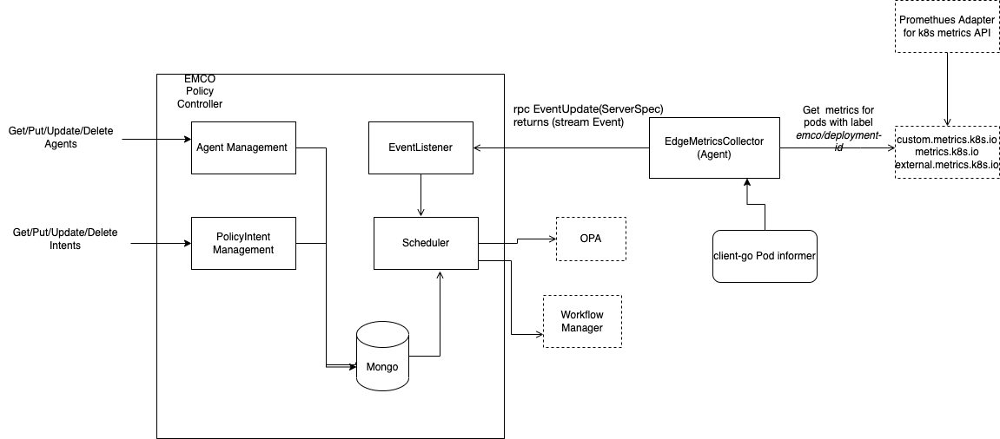
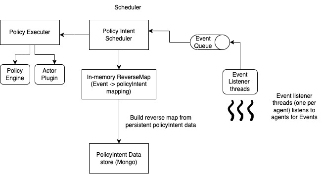

```text
   SPDX-License-Identifier: Apache-2.0
   Copyright (c) 2022 Aarna Networks, Inc.
```
## Policy Based Service Assurance  in EMCO
Kubernetes provide Horizontal Pod Autoscaler (HPA) for scaling based on policy. 
But in a multi-cluster environment, autoscaling & service assurance is more challenging problem. 
Some example use cases of service assurance/closed loop in the multi-cluster environment are as follows:

a) Migrate critical applications to a less loaded cluster when the load on clusters is non-uniform.  
b) A new instance of a MEC application can be instantiated in an edge location if the number of API requests to it crosses a threshold from the location.   
c) Migrate an application from one edge location to another based on policy.

EMCO policy controller solves this by providing an interface for collecting metrics from edges and providing a policy enforcement point (PEP).

### Design

Major components of policy in EMCO are 
1) Edge Metrics Collector 
2) Policy Service Assurance Controller
#### Edge Metrics Collector
Edge Metrics Collector runs on edges/target clusters and acts as a collector for metrics/events from the agent and passes it to the service assurance controller. We use Metrics API provided by Kubernetes for collecting the metrics. Kubernetes provides three types of metrics APIs 
1) metrics.k8s.io 
2) custom.metrics.k8s.io 
3) external.metrics.k8s.io  

In the initial release, we would be supporting only the collection of metrics from custom.metrics.k8s.io 
Edge Metrics Collector, is a Kubernetes controller, which watches a custom resource, MetricsCollector. MetricsCollector CR will contain the list of metrics that need to be monitored. Edge Metrics Collector will periodically fetch from custom.metrics.k8s.io.It will watch only resources that are managed by EMCO. It uses the label "emco/deployment-id" as the selector to filter the resources managed by EMCO.
Edge Metrics Collector collects these metrics and enriches the metrics with EMCO-related information like app context id and app name, and streams the metrics to the central policy controller.
#### Prometheus Adapter for Kubernetes Metrics APIs
https://github.com/kubernetes-sigs/prometheus-adapter  
To expose container and application metrics on custom.metrics.k8s.io, we can use the Prometheus adapter. This is an optional component and is not part of the policy controller system.
#### Policy Service Assurance Controller  

This is a central controller that runs along with other EMCO microservices. The following are functionalities of this controller:
1) Provides CURD APIs for policy intents 
2) Provides API for registering agents (Edge Metrics Collector) 
3) Collects metrics/Events from agents 
4) Send metrics/events enriched with policy intent data to the policy engine for evaluation. 
5) Send evaluation results to actor plugins for further action.

   


The service Assurance (SA) controller acts as a policy enforcement point. The major components of this controller are
1) Event listers - event listeners are threads which create a connection with each registered agent, and listen for the events. These events are queued for further processing by scheduler.
2) Event Reverse-Map - This is an in-memory data structure built from policy intent mongo entires. It holds a map of events to list policy intents related to the event.
3) Policy Executer - This is part where the action of sending events to the policy engine for evaluation and then the evaluation results to actors is executed.
4) Policy Intent Scheduler - The policy intent scheduler takes events from event stream and does necessary processing and enrichment and passes it to policy execute.

#### Policy Intent
Policy Intent defines the following 
1. Policy Engine derails
2. Policy Name and namespace
3. Actor and Actor Parameters
4. Event associated with the intent (Events are metrics names, along with optional agents)

Following is an example of policy intent:
```
{     "metadata": {
           "name": "policy", 
           "description": "",
           "userData1": "",
           "userData2": "" 
      }, 
      "spec": { 
            "policy": {
                "engineUrl" : "172.31.82.234:8181/v1",
                "namespace" : "emco",
                "policyName": "data" 
            },
            "actor": "temporal",
            "actorArg" : {"workFlowName": "dig17-workflow-intent"},
            "event": {
                 "agent": "",
                 "id" : "memory_usage_bytes"
            }
       }
}
```
### Policy Engine
The policy engine is the core of any policy system. It evaluates the input, against the rules. In this design, we consider the policy engine as an external entity. The policy intent should contain the endpoint of the engine. (In future, a default policy engine endpoint will be supported). Currently, the policy controller converts events to JSON and expects evaluation results in JSON. Open Policy Agent support the above format, and hence will be our default policy engine.
### Open Policy Agent
Open Policy Agent (OPA) is an open-source, domain-agnostic policy engine. OPA is the default policy engine for the EMCO policy controller. OPA uses policy language - Rego. A detailed explanation of OPA & Rego is out of the scope of this document.
Refer following documents for the detailed explanation
https://www.openpolicyagent.org/docs/latest/
https://www.openpolicyagent.org/docs/latest/policy-language/

### Actor
The actor is the component that takes the action, if required, based on the policy evaluation results. We follow plugin architecture for actors. Currently, we support EMCO workflow manager as the actor plugin. The actor plugins in the policy controller are responsible for converting evaluation results to the format that the corresponding actor understands.
### Relation between DIG, Events and Policy
Policy intents are applied as intended in a Deployment Intent Group (DIG). On arrival of an event(metrics) from agents, the policy controller runs it against each policy intent. The controller keeps a reverse map of events to policy intent for faster traversal of events. Events, along with intent details are sent to the policy engine as per the intent. The evaluation result from the policy engine is then processed by the actor, which is specified in the intent.
For example, the workflow manager plugin calls the workflow as per the policy intent. Generally, workflow in the same DIG to which policy belongs is called. This allows using same policy intent specification applied to different DIGs  
For example, if we have two composite apps, ngnix and mongo and a scale-out workflow (say, scaleout-multicluster), and a policy for scale-out on CPU load threshold, we can have policy intent (scaleout-on-cpu-intent) 
```
{ "metadata": {
            "name": "scaleout-on-cpu-policy-intent",
          "description": “Policy intent for initiating scale-out workflow if cpu load crosses threshold” 
           },
          "spec": {
            "policy": { 
                "engineUrl" : "172.31.82.234:8181/v1",
                "namespace" : "emco",
                "policyName": “cpu-load” 
            },
            "actor": "temporal",
             "actorArg" : {
                "workFlowName": “scaleout-workflow”
             },
            "event": {
               "agent": "",
               "id" : “cpu-usage-percentage”
             }
          }
}
```

Now we can assign this policy to both composite applications. 
```
  ngnix -> DIGY -> scaleout-on-cpu-policy-intent
  mongo -> DIGX -> scaleout-on-cpu-policy-intent
```
As a prerequisite, workflow scaleout-workflow is required to be applied to bothNow policy controller monitors the metric   ‘cpu-usage-percentage’ from all containers that belong to these composite applications. And policy “cpu-load” is evaluated for any violation. If a violation is found, that is cpu load crossed threshold specified in the policy, the workflow ‘scaleout’ is initiated in the same DIG.

### Database Interaction & Data Model
Policy controller stores policy intent and agent details in mongo. It uses same mongo instance as orchestrator.
Policy controller creates two types of documents, _policyIntent_ and _agent_. 

Uses orchestrator libraries for reading and writing data to mongo. Library ensures parent resources are present while creating a new resource.

#### PolicyIntent
 - PolicyIntent is the document that stores relation between policy, events (events/metrics from agents) and CompositeApp/DIG  
 - policy controller provides CRUD APIs, which in turn writes the document to mongo  
 DB - emco  
 Collection - resources  
 document key :- project,compositeApp,compositeAppVersion,deploymentIntentGroup, policyIntent  
 Schema :- 
 ```text
{
  "$schema": "http://json-schema.org/draft-04/schema#",
  "type": "object",
  "properties": {
    "metadata": {
      "type": "object",
      "properties": {
        "name": {
          "type": "string"
        },
        "description": {
          "type": "string"
        },
        "userData1": {
          "type": "string"
        },
        "userData2": {
          "type": "string"
        }
      },
      "required": [
        "name"
      ]
    },
    "spec": {
      "type": "object",
      "properties": {
        "policy": {
          "type": "object",
          "properties": {
            "engineUrl": {
              "type": "string"
            },
            "namespace": {
              "type": "string"
            },
            "policyName": {
              "type": "string"
            }
          },
          "required": [
            "engineUrl",
            "policyName"
          ]
        },
        "actor": {
          "type": "string"
        },
        "actorArg": {
          "type": "object",
          "properties": {
            "workFlowName": {
              "type": "string"
            },
            "workFlowMgr": {
              "type": "string"
            }
          },
          "required": [
            "workFlowName",
            "workFlowMgr"
          ]
        },
        "event": {
          "type": "object",
          "properties": {
            "agent": {
              "type": "string"
            },
            "id": {
              "type": "string"
            }
          },
          "required": [
            "agent",
            "id"
          ]
        }
      },
      "required": [
        "policy",
        "actor",
        "actorArg",
        "event"
      ]
    }
  },
  "required": [
    "metadata",
    "spec"
  ]
}
```

#### Agent
- Agent document holds details about metrics collectors/agent. Currently, only user defined id and endpoint is stored.  
db: emco  
collection: resources  
key: policyModule, agent  
* policyModule is a dummy parent, defined for base for all generic policy controller documents
Schema:  

```text
{
"$schema": "http://json-schema.org/draft-04/schema#",
"type": "object",
"properties": {
"addr": {
"type": "string"
}
},
"required": [
"addr"
]
}
```
##### Reference schema
(Used by orchestrator for initializing)
``` 
#emco-policy
- name: policyIntent
  parent: deploymentIntentGroup
- name: policyModule
- name: agent
  parent: policyModule
```  

### Scalability
In the current design, the scalability of the policy controller is not considered. Running more than one instance of a policy controller may not give a consistent result. For supporting scalability, the design requires the following points to be considered:
1. The data structures like event reverse map are in-memory. These data structures are accessed very frequently, hence disk reads are not affordable. Hence, user updates on mongo-db from different instances of the policy controller has to be sync-hed to this in-memory DS periodically.
2. Should avoid multiple controller instances acting on the same event. This can result in duplicate actions.

### Roadmap/Known Problems
1. Action Stabilisation:- There would be a time gap between the action initiated and its effect getting reflected in the measurement. Hence controller should not initiate duplicate actions. Currently, this will result in duplicate actions 
2. OpenAPI schema for policy APIs
3. Test Coverage - Need to improve on unit testing and code coverage
4. Metrics/Tracing Support