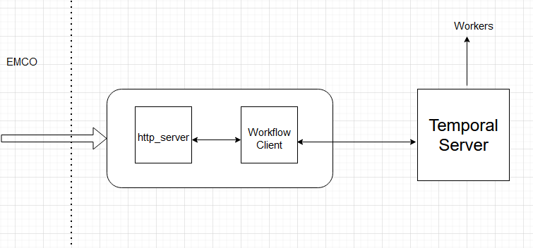

[//]: # "SPDX-License-Identifier: Apache-2.0"
[//]: # "Copyright (c) 2020-2022 Intel Corporation"

# Workflow Client - Server and Temporal Client to Queue Workflows for Execution.

This document will be going over the structure of the workflow client and it's http server
to make it easier for developers to use the EMCO Temporal controller and write their own workers.

This document will assume you have a basic understanding of Temporal. If you do not please visit [their docs](https://docs.temporal.io/), and
familiarize yourself with the basics.

## How It Works

As a quick refresher the Temporal Client is what submits workflows to the temporal engine to be scheduled for execution. 
The workers in temporal are used to actually do that job, and the temporal engine is what controls + manages them. The image
below shows the flow of an EMCO controller making a request to temporal for a workflow to be executed.

In the context of EMCO currently the HTTP server that handles the temporal requests, and the temporal client itself 
are both expected to be running inside the same container.



### The HTTP Server

The user will make a request to schedule a temporal workflow from one of the temporal controllers inside of EMCO. This will be handled by the http server.
The user will make a request to the workflow client by POSTing to the /invoke path on the workflow client's http server.

The server will expect the body of the request to only be the temporal information. You can find the struct for it [here](https://gitlab.com/project-emco/core/emco-base/-/blob/main/src/workflowmgr/pkg/emcotemporalapi/emco_temporal_api.go).
The server will also be expecting the controller to have validated the data submitted to them.

Once the server receives the request from the user it will unmarhsal the temporal workflow parameters into a temp JSON file.
Once the data has been stored in the temporary JSON file the server will move on to execute the workflow clients binary.
The http server will execute the workflow client binary via the OS library using commands on the CLI. It will pass the 
location of the JSON file to the workflow client as a command line argument to the workflow client. Once the server executes the
workflow client binary all that is left for the http server is to wait for the response from the workflow client, and then to pass that
status back to the user who invoked the client.

### The Workflow Client

The remainder of the job is done inside of the workflow client itself. It has just been executed
by the server, and handed all the information it needs to finish the job.

The first thing it is going to do is use its predefined environmental variables to find the 
location of the temporal server itself. Once that is complete it will move on to retrieving
all the relevant information from the temporary JSON file. It will take the file name from
the command line argument, and read the file. It will then put all of the options into a 
struct.

Now that it has everything it needs it will create the workflow options variable from the 
data it just unmarshalled, make a connection to the temporal server, and then schedule the 
workflow to be executed. It will wait for whatever response the Temporal server gives it, and
hand it back to the http server. Who will finish up the entire process by returning that to the user.


## EMCO Temporal Struct

The final item worth going over in some detail is the temporal struct in EMCO located [here](https://gitlab.com/project-emco/core/emco-base/-/blob/main/src/workflowmgr/pkg/emcotemporalapi/emco_temporal_api.go) 
and [here.](https://gitlab.com/project-emco/core/emco-base/-/blob/main/src/workflowmgr/pkg/module/workflow_intent.go)


This struct is how a developer fine tunes their workers, can request different jobs to be done, etc. This next section will just go over the 
data inside that struct and what it means.

```
{
"workflowClient": {
      "clientEndpointName": "demo-workflowclient.demo.svc.cluster.local",
      "clientEndpointPort": 9090
    }
}
```

The workflow client section of the struct is to let the emco controller know where 
the workflow client resides. It just needs a resovable domain, and the port it is running on.

```
{
    "temporal": {
      "workflowClientName": "migrate_workflowclient",
      "workflowStartOptions": {
        "ID": "pre-install-1",
        "TaskQueue": "GREETING_TASK_QUEUE",
        "WorkflowExecutionTimeout": 0,
        "WorkflowRunTimeout": 0,
        "WorkflowTaskTimeout": 0,
        "WorkflowIDReusePolicy": 0,
        "WorkflowExecutionErrorWhenAlreadyStarted": false,
        "RetryPolicy": {
          "InitialInterval": 0,
          "BackoffCoefficient": 0,
          "MaximumInterval": 0,
          "MaximumAttempts": 2,
          "NonRetryableErrorTypes": null
        },
        "CronSchedule": "",
        "Memo": null,
        "SearchAttributes": null
      },
      "workflowParams": {}
    }
}
```

From the rest of the list above there are only three things worth pointing out specifically:

 - WorkflowClientName: this is the client that will be invoked in the /invoke/{client} to the http server.
 - ID: the name of this specific workflow to be scheduled
 - Task Queue: The task queue is essentially how temporal distinguishes the different tasks it can complete. You can read about it more [here](https://docs.temporal.io/concepts/what-is-a-task-queue/)

The rest of the items can be read about inside of the temporal golang documentation: [Workflow Start Options](https://pkg.go.dev/go.temporal.io/sdk@v1.15.0/internal#StartWorkflowOptions), [Retry Policy](https://pkg.go.dev/go.temporal.io/sdk@v1.15.0/internal#RetryPolicy), and [Activity Options](https://pkg.go.dev/go.temporal.io/sdk@v1.15.0/internal#ActivityOptions)
