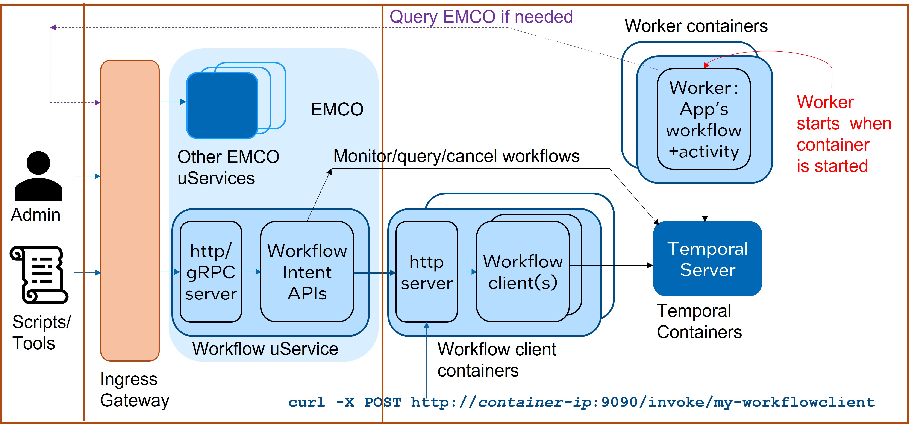

```text
SPDX-License-Identifier: Apache-2.0
Copyright (c) 2022 Intel Corporation
```
<!-- omit in toc -->
# Temporal Workflows in EMCO

This document describes the integration of Temporal workflow engine with
EMCO. The first two sections give a broad overview whereas the later
sections offer a deeper look at the integration model. This document does
not introduce [Temporal](https://docs.temporal.io/docs/temporal-explained/introduction).

## Problem Statement 

EMCO is an extensible orchestrator whose functionality can be enhanced by
adding new controllers. Placement controllers, action controllers and
controllers that run after the deployment intent group (DIG) has been
instantiated can all extend functionality in different ways. Yet they are
not always applicable in every scenario where new functionality is needed.

For one, these controllers all have equal access to the mongo and etcd
databases, and are all equivalent in terms of Role-Based Access Control,
since they are behind a common ingress gateway. In situations where the
agent implementing new functionality must have limited db access and/or
different RBAC controls, the agent cannot be implemented as a controller.

More importantly, a controller gets activated only when a DIG is
instantiated, updated or migrated. There are many scenarios where an
action must be performed outside this context. Here are some example
scenarios:

 * Migrate an application from cluster A to cluster B when one of these
   events happens:
    * there comes a 5G notification that the UE has moved to another UPF,
      and cluster B is now closer to the UE.
    * cluster A needs to be brought down for maintenance.
    * cluster A is approaching its capacity limit.
 * Update the network policies (firewall rules, load balancer policies,
   etc.) in an external device based on events unrelated to application
   deployment or trmination.
 * Spin up a new Kubernetes cluster.

The last two relate to infrastructure orchestration, rather than
application lifecycle management. In these scenarios, we need a new
mechanism to initiate action from EMCO.

## Solution: Workflows in EMCO

To handle actions for infrastructure orchestration and application
lifecycle management outside of a deployment intent group (DIG)
operation, EMCO offers support for workflows.

A workflow is a sequence of tasks that is stateful, long-running and
needs to be resilient against failure of any component task. The example
scenarios in the previous section are all examples of workflows. In
general, a workflow may be a batch job, a cron job that runs periodically,
or any other workload pattern. The tasks within a workflow may run
sequentially, concurrently, or be activated in response to events outside
the workflow. Multiple workflows may run concurrently, within and across
Kubernetes clusters. 

A workflow client is a user-provided software that launches workflows and
optionally monitors, queries or terminates them.

An organization may have a set of roles that create workflows and workflow
clients, which are the workflow authors, and another set of roles that
deploy and manage them, which are the workflow administrators.

EMCO now includes workflows as a powerful extensibility mechanism. Custom
workflows from end users can be launched from EMCO through user-provided
workflow clients. They may also be monitored, queried and terminated
either directly from EMCO or through a custom workflow client. In other
words, the workflow administrator can work through EMCO alone.

When a workflow is bring monitored, one may want to make further decisions
based on the observed status, such as generate a notification or an alarm,
or cancel the workflow. When the monitoring is done through EMCO, the
decision logic can be based off the EMCO status API output. Alternatively,
a custom workflow client can perform monitoring, decision-making and the
action. That allows for an integrated approach but at the expense of
another workflow client.

There are many benefits that come from integrating workflows into EMCO, both
for the EMCO community as well as the workflow community. The workflow
community gets the following benefits:
 * EMCO can deploy workflow workers and workflow clients together as a
   composite application.
   * Workflows can be deployed across clusters, making them geo-distributed,
     replicated, and versioned, as all EMCO apps can be.
   * Workflow deployment gets more flexibility:
     * They can be deployed with different intents and profiles in
       different environments, such as development, testing and production.
     * EMCO intents can be used to place workflows in appropriate clusters
       and to edit them using the Generic Action Controller.
     * Shared parameters between workflows and their clients are easily
       encapsulated.
 * Workflows can leverage EMCO's rich knowledge of cluster topology and
   application structure using EMCO's query/update APIs.
 * Workflows can use EMCO's access to clusters where appropriate by
   invoking EMCO APIs; this helps to have a single place (i.e., EMCO) for
   all authentication and authorization for cluster access.
 * The role distinction between workflow creators and administrators is
   preserved, but the workflow administrator can use EMCO as a single pane
   of glass figuratively.

The EMCO community also benefits for these reasons:
 * Workflows can be treated as any other composite applications.
 * Workflows can be written in languages other than Go. This broadens the
   community that can use EMCO.

Workflows are run and managed by a workflow engine. Many open source
workflow engines are available. EMCO offers integration with the [Temporal
workflow engine](https://docs.temporal.io/docs/temporal-explained/introduction)
for the following reasons:
  * Temporal is open-source, available under the liberal MIT license.
  * Temporal offers SDKs to write workflows in many languages, including Go.
  * There was apparent community interest in Temporal.

It is important to note that other workflow engines are *not* excluded.
They can be added in the future; in fact, the Temporal integration may be
taken as a template for integrating other engines.

## EMCO Workflow Model
EMCO's workflow terminology and model are mostly based on Temporal but it
is believed to be sufficiently general that it can be adapted for others.

### Component Relationships
A workflow is executed by a worker entity within a worker process; there
can be one or more worker entities within a worker process, and one or more
worker processes in a system. 

There can be multiple workflow clients. Each client may launch many workflows,
including copies of the same workflow, with some way to distinguish them.
(In a Temporal system, this unique marker is the workflow ID in most cases
or the workflow-ID/run-ID pair in some cases.) 

The communication between the workers and the workflow clients can take any
form: EMCO does not mandate anything.

### Combined Deployment of EMCO and Temporal

Figure 1 depicts the relationship between Temporal components and EMCO
components in a combined deployment.



Figure 1 - EMCO Deployment with Temporal

The leftmost compartment shows the end users (humans or agents), the middle
one has the EMCO components and the rightmost compartment has Temporal components.

A worker or a workflow client can be a plain process in an OS but it is
recommended that they each be packaged into containers and deployed via Helm
charts.

The diagram depicts workers and workflow clients as packaged in separate
container images, deployed separately, and scaled separately. 

EMCO, including the newly added `workflowmgr` microservice, is usually
deployed in a namespace. In practice, some kind of ingress gateway is
deployed in front of the EMCO microservices, though core EMCO does not
include it.

The EMCO `workflowmgr` microservice interacts with Temporal components in
two ways: it can invoke a `HTTP POST` operation on a workflow client to
start a workflow, and it can invoke Temporal SDK APIs directly on the
Temporal server for status checks, workflow queries and workflow
cancellation/termination. 

The Temporal server, workers and workflow clients need not be co-located in
the same Kubernetes worker node or even the same cluster; they only need
network access to each other. The EMCO microservices could be deployed on
yet another cluster, as long as it can access the workflow client and the
Temporal server (access to the worker processes is not required).

### What EMCO Needs From Temporal Workflows
Broadly, EMCO puts very little restrictions on how workers and worfklow
clients are structured or how they communicates, as described in the
previous section.

The workflow client process or container is expected to expose a HTTP
URL of the form `/invoke/{workflowclientname}`, which can take a `HTTP POST` 
call with the workflow parameters as the `POST` body. In addition, the
`POST` call is expected to be non-blocking: since workflows may run for
days or weeks, the call should only start the workflow and return
immediately.

There are different ways to check the status of a Temporal workflow. The
following can be done generically for all workflows:
 * Block till the workflow completes and get the final result.
 * Get a description of a workflow with the `DescribeWorkflowExecution()` API.
 * Get the event history of an open or closed workflow with the
   `GetWorkflowHistory()` API. If the workflow is open, optionally block
   till it completes.
In addition, Temporal also supports custom workflow queries, which are
functions written by the workflow author which can be queried when the
workflow is open or closed. This clearly needs support from the workflow
author, and the workflow admin needs to know the name and parameters for
each query along with the result format.

EMCO supports all these different ways. The `status` API can be used to do
one or more of these methods in a single call. The output is in JSON format
and can be parsed on the client side.

### EMCO Workflow Intents
An EMCO workflow intent encapsulates all the information needed to start a
workflow.

To start a workflow, EMCO needs the following data:
 * Mandatory:
   * The network endpoint of a workflow client container.
   * The name of a workflow client within that container.
   * The workflow ID to be assigned to the workflow.
 * Optional:
   * Temporal options (timeouts, retry policies, etc.) for the workflow as
     a whole.
   * Temporal options for each activity within the workflow.
   * Workflow-specific parameters for each activity within the workflow.

The Temporal SDK includes the workflow ID in the `StartWorkflowOptions`
data structure. The intent layout in the code is organized based on that.

The `status` API takes the workflow intent name but it also needs the
following:
 * Mandatory:
   * Temporal server's network endpoint.
 * Optional:
   * Flags to indicate which status methods to run. All default to `false`.
   * A query name and its parameters.

## Security Considerations
There are several possible security implications which need to be
considered in the future:
 * EMCO may need a service account and appropriate authorization to start a
   workflow or query the Temporal server, if they are deployed behind an
   application gateway.
 * EMCO may need to invoke `HTTP POST` to start a workflow using `https`
   instead of `http`. This needs certificates and certificate chains for
   each side, possibly with a CA. This raises questions of a common CA for
   EMCO and Temporal.

## Resources
 * [Temporal workfow engine](https://docs.temporal.io/docs/temporal-explained/introduction)

