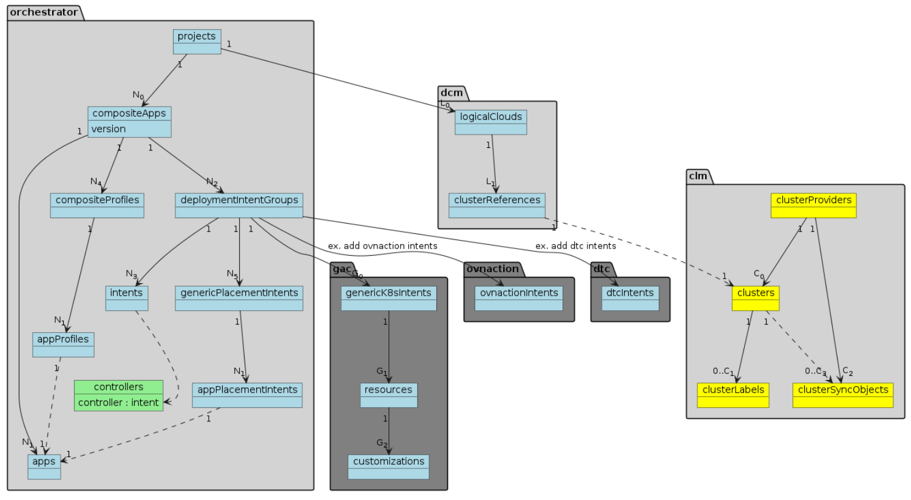

```
Copyright (c) 2022 Intel Corporation
```

# Introduction

This document provides an example of the steps required to configure EMCO controllers, onboard clusters and prepare and deploy an EMCO Composite Application.

# Overview of ECMO Database Resources

EMCO is configured by the user making REST API calls to various EMCO microservices which expose a REST API.  These API calls are performed to do things like register clusters, onboard applications, specify deployment intents and so on.  Each create (e.g. POST) call generally will create a resource which is saved in the EMCO database.  These EMCO resources generally have relationships to other resources.  The following diagram depicts a partial view of these relationships.



- Core EMCO microservices, such as `orchestrator` and `dcm`, are shown in light gray.  A few of the EMCO action controllers, such as `gac` and `dtc`, are shown in dark gray.
- The database resources are depicted as the objects within the EMCO microservices that provides the REST API for that resource.
- EMCO resources have a parent-child relationship with other resources, which is depicted by the solid arrows in the diagram.
- The parent-child relationship of resources is embedded in the API design as well, and can be seen in the URLs (or anchors) for any given resource.  (See the examples later in this document and compare against the diagram.)
- Referencing relationships are made as well, a few are depicted in the diagram with dotted line arrows.  E.g. a `clusterReference` in the `dcm` microservice will reference a `cluster` in `clm`.
- Cardinality notes are present on many of the arrows, indicating, for example, that a given `project` may have N<sub>0</sub> `compositeApps` created under it.
- EMCO follows the rule that parent resources must be created before child resources, and on deletion, child resources must be deleted before the parent resource.
- There are further details to the rules that the EMCO database follows.  A deeper dive into how this works can be found in [EMCO Referential Integrity](../developer/ReferentialIntegrity.md).


# Prerequisites
First, EMCO needs to be built and deployed, instructions for which can be found in the [README](https://gitlab.com/project-emco/core/emco-base/-/blob/main/README.md), and various EMCO releases can be found in the [Releases](https://gitlab.com/project-emco/core/emco-base/-/releases) page. Following the building and deployment of EMCO, we must set up the fundamentals, which are Controllers, Clusters, Projects, and Logical Clouds.

## Controllers
 The `controllers` in EMCO are microservices that perform specific tasks. There are various types of controllers in EMCO. Some controllers provide gRpc endpoints and are invoked from other controllers.  For example, orchestrator invokes 2 types of controllers placement and action controllers. Placement controllers are used for making placement decisions and action controllers are called during LCM events to provide specific functionality. Example of Placement controller is `hpaplc` and action controllers are `ovnaction`, `gac` and `dtc`. There are other types of controllers in EMCO that are standalone and are not invoked from other controllers. Examples of such controllers are `clm` for cluster management, `dcm` for logical cloud management, and others. Please refer to the design document for detailed description of all the controllers.

 Placement and action controllers need to be registered with the orchestrator. To register a controller, we need to supply the host, port number, type, and priority of the controller.

When EMCO is deployed in a Kubernetes cluster, the name of the `Kubernetes Service` corresponding to the controller is used for the `host` attribute.  The internal port of the `Kubernetes Service` (i.e. DNS name of the service) is used for the `port` attribute.  The `controllers` used by the EMCO `orchestrator` have a `type` of  either `placement` or `action` controllers.  See [Placement and Action Controllers in EMCO](https://gitlab.com/project-emco/core/emco-base/-/blob/main/docs/design/emco-design.md#placement-and-action-controllers-in-emco) for more information about these controllers.

NOTE - the `rsync` controller also needs to be registered with the `controller` API.  `Rsync` is the EMCO microservice which is responsible for deploying resources to clusters, and is used by a number of EMCO microservices.  The `type` attribute should not be set for `rsync`.

### Controller Service Names and Ports

Once EMCO has been deployed, the `Services` will appear as follows in the EMCO Kubernetes cluster.  The following output is edited to show just the controllers that may need to be registered with the `controller` API. Any given `action` or `placement` controller only needs to be registered if it is going to be used in the deployment of a composite application (or more precisely, a Deployment Intent Group).

```
$ kubectl -n emco get service
NAME                 TYPE        CLUSTER-IP       EXTERNAL-IP   PORT(S)                         AGE
rsync                NodePort    10.109.225.174   <none>        9031:30431/TCP                  14d

           Placement Controllers
hpaplc               NodePort    10.111.170.149   <none>        9099:30499/TCP,9091:30491/TCP   14d

           Action Controllers
dtc                  NodePort    10.109.243.8     <none>        9048:30448/TCP,9018:30418/TCP   14d
gac                  NodePort    10.109.162.212   <none>        9033:30433/TCP,9020:30420/TCP   14d
hpaac                NodePort    10.105.23.131    <none>        9042:30442/TCP                  14d
ovnaction            NodePort    10.99.60.27      <none>        9032:30432/TCP,9051:30451/TCP   14d
sfc                  NodePort    10.103.135.92    <none>        9056:30456/TCP,9055:30455/TCP   14d
sfcclient            NodePort    10.102.160.247   <none>        9058:30458/TCP,9057:30457/TCP   14d
swc                  NodePort    10.109.59.252    <none>        9088:30488/TCP                  14d
tac                  NodePort    10.102.2.234     <none>        9065:30465/TCP,9064:30464/TCP   14d
workflowmgr          NodePort    10.107.107.74    <none>        9097:30497/TCP,9095:30495/TCP   14d
```

Most controllers expose both a REST API service port for taking in associated intents and a gRPC control port for interaction with the `orchestrator` or other EMCO microservices.  In some cases, a given controller does not have a REST API, so only the gRPC control port is present.

The [EMCO Port Numbers](AboutServicePorts.md) document lists the service and control ports that are assigned by the default EMCO deployment.

### Example Controller Registration

```
    version: emco/v2
    resourceContext:
      anchor: controllers
    metadata :
      name: rsync
    spec:
      host: rsync
      port: 9031
```

```
    version: emco/v2
    resourceContext:
      anchor: controllers
    metadata :
      name: gac
    spec:
      host: gac
      port: 9020
      type: "action"
      priority: 1
```

And so on, for any other controller that needs to be set up for use.

### Example Controller Registration with NodePorts

In a development environment it is sometimes convenient to register the controllers with the Node IP and NodePort.
Note that many of the EMCO [examples](../../examples) have been set up to work in this way.

```
    version: emco/v2
    resourceContext:
      anchor: controllers
    metadata :
      name: rsync
    spec:
      host: 10.10.10.6
      port: 30431
```

```
    version: emco/v2
    resourceContext:
      anchor: controllers
    metadata :
      name: gac
    spec:
      host: 10.10.10.6
      port: 30433
      type: "action"
      priority: 1
```

## Cluster Onboarding

Before onboarding clusters, a `Cluster Provider` needs to be created first. The cluster provider is the entity that owns and registers clusters with EMCO. EMCO supports clusters of type k8s, fluxcd, azureArc, and anthos. We can broadly classify them as Direct and GitOps clusters. Among the Direct clusters, k8s is an example, while fluxcd, azureArc, and anthos are examples of GitOps clusters.

### Direct Clusters

We create the cluster provider and then register clusters to them. When registering direct clusters, we must provide a path to the KubeConfig file.

```
---
#creating cluster provider
version: emco/v2
resourceContext:
  anchor: cluster-providers
metadata :
   name: provider1

---
#creating cluster
version: emco/v2
resourceContext:
  anchor: cluster-providers/provider1/clusters
metadata :
   name: cluster1
file:
  <path to the KubeConfig file>
```

### GitOps Clusters

For GitOps cluster like fluxcd, azureArc, and anthos we need to provide certain credentials and other parameters after creating the cluster provider. We use the `cluster-sync-objects` endpoint to achieve this. Considering an Azure Arc GitOps type cluster, the following `cluster-sync-object` named `GitObjectAzure` provides the credentials and other information  used to access the Azure Arc clusters, while `cluster-sync-object` named `GitObjectRepo` provides the credentials and other information used to access the
corresponding GitHub repositories.

```
---
# creating cluster provider
version: emco/v2
resourceContext:
  anchor: cluster-providers
metadata:
   name: provider1
---
# creating cluster provider kv pair for GitObjectRepo
version: emco/v2
resourceContext:
  anchor: cluster-providers/provider1/cluster-sync-objects
metadata:
  name: GitObjectRepo
spec:
  kv:
  - gitType: github
  - userName: test-user
  - gitToken:  <GITHUB TOKEN>
  - repoName: test-repo
  - branch: main

---
# creating cluster provider kv pair for GitObjectAzure
version: emco/v2
resourceContext:
  anchor: cluster-providers/provider1/cluster-sync-objects
metadata:
  name: GitObjectAzure
spec:
  kv:
  - clientID: <Client ID from Azure account>
  - tenantID: <Tenant ID from Azure account>
  - clientSecret:  <Client Secret to access Azure account>
  - subscriptionID: <Subscription ID from Azure account>
  - arcCluster: Arc-cluster-1
  - arcResourceGroup: Arc-rg
  - timeOut: "60"
  - syncInterval: "60"
  - retryInterval: "60"
```

Once the `cluster provider` and `cluster-sync-objects` are created we register the clusters.

```
    version: emco/v2
    resourceContext:
      anchor: cluster-providers/provider1/clusters
    metadata:
      name: cluster1
    spec:
      gitOps:
        gitOpsType: "azureArc"
        gitOpsReferenceObject: GitObjectRepo
        gitOpsResourceObject: GitObjectAzure
    file:
     values.yaml
  ```

After the clusters are registered we can optionally tag them with labels.

```
    version: emco/v2
    resourceContext:
      anchor: cluster-providers/provider1/clusters/cluster1/labels
    clusterLabel: edge-cluster
```

## Projects

The project provides a means of grouping collections of applications and allows for defining applications with different tenants. We create the project as follows.

```
    version: emco/v2
    resourceContext:
      anchor: projects
    metadata :
      name: project1
```

## Logical Cloud

The Logical Cloud is a grouping of one or many clusters, each with its own control plane and specific configurations, which get partitioned for a particular EMCO project. This partitioning is made via the creation of distinct, isolated namespaces in each of the Kubernetes clusters that make up the Logical Cloud.
Applications are deployed in clusters belonging to one logical cloud.

Three types of Logical Clouds are provided as described below: Standard, Admin and Privileged. Standard and Admin clouds are supported for GitOps based clusters.

### Standard Logical Cloud

Logical Clouds are used to group and partition clusters in a multi-tenant way and across cluster boundaries. To create a logical cloud, the admin user specifies permissions, resource quotas and the set of clusters that compose it.

```
---
#create privileged logical cloud
version: emco/v2
resourceContext:
  anchor: projects/project1/logical-clouds
metadata:
  name: logicalCloud1
spec:
  namespace: test-ns
  user:
    userName: user-1
    type: certificate

---
#add primary user permission (only one that is allowed in standard logical clouds)
version: emco/v2
resourceContext:
  anchor: projects/project1/logical-clouds/logicalCloud1/user-permissions
metadata:
    name: permission1
spec:
    namespace: test-ns
    apiGroups:
    - "*"
    resources:
    - "*"
    verbs:
    - "*"

---
#add cluster reference to logical cloud
version: emco/v2
resourceContext:
  anchor: projects/project1/logical-clouds/logicalCloud1/cluster-references
metadata:
  name: clusterRef1
spec:
  clusterProvider: provider1
  cluster: cluster1
  loadbalancerIp: "0.0.0.0"

```

### Admin logical cloud

An Admin logical cloud is a special cloud that has admin permissions. For creating Admin cloud level field is set to value "0". With Admin logical cloud a user has control over all the namespaces of the clusters. To create this type user needs to provide clusters that compose that logical cloud.

```
    ---
    # create admin logical cloud
    version: emco/v2
    resourceContext:
    anchor: projects/project1/logical-clouds
    metadata:
    name: logicalCloud1
    spec:
    level: "0"

    ---
    # add cluster reference to logical cloud
    version: emco/v2
    resourceContext:
    anchor: projects/project1/logical-clouds/logicalCloud1/cluster-references
    metadata:
    name: clusterRef1
    spec:
    clusterProvider: provider1
    cluster: cluster1
    loadbalancerIp: "0.0.0.0"

```


### Privileged Logical Clouds

This type of Logical Cloud provides most of the capabilities that an Admin Logical Cloud provides but at the user-level like a Standard Logical Cloud. New namespaces are created, with new user and kubeconfig files. However, the EMCO project can now request an enhanced set of permissions/privileges, including targeting cluster-wide Kubernetes resources.

```

---
#create privileged logical cloud
version: emco/v2
resourceContext:
  anchor: projects/project1/logical-clouds
metadata:
  name: logicalCloud1
spec:
  namespace: test-ns-1
  user:
    userName: user-1
    type: certificate

---
#add primary user permission
version: emco/v2
resourceContext:
  anchor: projects/project1/logical-clouds/logicalCloud1/user-permissions
metadata:
    name: pp1
spec:
    namespace: test-ns-1
    apiGroups:
    - "*"
    resources:
    - "*"
    verbs:
    - "*"

---
#add kube-system namespace user permission
version: emco/v2
resourceContext:
  anchor: projects/project1/logical-clouds/logicalCloud1/user-permissions
metadata:
    name: pp2
spec:
    namespace: kube-system
    apiGroups:
    - "*"
    resources:
    - "*"
    verbs:
    - "*"

---
#add cluster-wide user permission
version: emco/v2
resourceContext:
  anchor: projects/project1/logical-clouds/logicalCloud1/user-permissions
metadata:
    name: pp3
spec:
    namespace: ""
    apiGroups:
    - "*"
    resources:
    - "*"
    verbs:
    - "*"

---
#add cluster reference to logical cloud
version: emco/v2
resourceContext:
  anchor: projects/project1/logical-clouds/logicalCloud1/cluster-references
metadata:
  name: clusterRef
spec:
  clusterProvider: provider1
  cluster: cluster1
  loadbalancerIp: "0.0.0.0"

```

# Composite Applications

EMCO supports the concept of a `Composite Application` which is composed of a set of `Applications` which work together, perhaps across multiple clusters, to provide
a service.  Via the use of placement intents, EMCO controls the placement of specific `Applications` in the `Composite Application` to sets of one or more
target clusters.  Action intents, as supported by various action controllers, are used to automate the configuration of `Application` resources both within given target clusters and between different clusters.
At this time, an `Application` in EMCO corresponds to a Helm chart.

## Example Composite Application

The following `Composite Application` resource illustrates the key elements of the `Composite Application` resource - using the `emcoctl` yaml notation for convenience.

```
version: emco/v2
resourceContext:
  anchor: projects/project1/composite-apps
metadata :
  name: example-composite-app
spec:
  compositeAppVersion: v1
```

1. The `anchor` (which represents the URL) of the `Composite Application` indicates that this `Composite Application` is being created in `project1`.
1. The name of the `Composite Application` is identified by `metadata.name`.
1. The `Composite Application Version` is identified `spec.compositeAppVersion`.
   - NOTE: The `CompositeApplicationVersion` as specified in the `spec` of the `Composite Application` is a rare exception in the EMCO
     data model where two elements of the `key` or `identification` of an EMCO resource are defined in a single resource.  That is, in
     subsequent resources that are children of the `Composite Application`, the name and version of the `Composite Application` are
     both part of the `anchor` or URL of the child resource.

## Adding Applications to a Composite Application

The following `Application` resource illustrates how an Application (Helm chart) is added to a Composite Application and Version.

```
version: emco/v2
resourceContext:
  anchor: projects/project1/composite-apps/example-composite-app/v1/apps
metadata :
  name: collectd
file:
  /path/to/helmfile/collectd.tar.gz
```

1. Note that the previously created `example-composite-app` and version `v1` are part of the `anchor` of the new `Application`.
1. The EMCO name of the `Application` (which is used as a reference in other EMCO resources) is defined by `metadata.name`.
1. The REST API call to create an `Application` is a multi-part call that takes a filename.  The `file` attribute identifies
   the location of the Helm chart for the `Application`.

We can add more Applications to a Composite Application, for example we can add `operator` Application to the Composite Application as illustrated below.

```
version: emco/v2
resourceContext:
  anchor: projects/project1/composite-apps/example-composite-app/v1/apps
metadata :
  name: operator
file:
/path/to/helmfile/operator.tar.gz
  ```
# Composite Profiles

The `Composite Profile` identifies a collection of `Application` profiles that can be associated with a `Composite Application`.
Multiple `Composite Profiles` may be created for a `Composite Application`.  The profile concept allows for customization of
the `Composite Application` for specific instantiations.  For example, profiles could be useful for differentiating deployments
to different regions.  Or, perhaps, a fully featured maximal deployment vs a trimmed down minimal deployment.

## Example Composite Profile

The following `Composite Profile` resource illustrates an example of a `Composite Profile`.

```
version: emco/v2
resourceContext:
  anchor: projects/project1/composite-apps/example-composite-app/v1/composite-profiles
metadata :
  name: example-composite-profile
```

1. The `Composite Profile` resource provides a name for the collection of application profiles that apply to specific applications.

## Adding Application Profiles to a Composite Profile

The following illustrates the addition of an application profile.

```
version: emco/v2
resourceContext:
  anchor: projects/project1/composite-apps/example-composite-app/v1/composite-profiles/example-composite-profile/profiles
metadata :
  name: collectd-profile
spec:
  app: collectd
file:
  /path/to/profile/file/collectd_profile.tar.gz
```

The application profile is a multi-part call that takes a filename, which holds the details of the profile.

## Application Profile Details

A profile for an application is a `tar.gz` file which holds a values override file and a set of additional files
which will be added to, or replace, files in the application Helm chart.  A manifest file lists the contents of the profile.

The following illustrates the structure of an example profile:

```
manifest.yaml
override_values.yaml
profile/new_collectd.conf
profile/extra.conf
```

The corresponding `manifest.yaml` looks like:

```
---
version: v1
type:
  values: "override_values.yaml"
  configresource:
    - filepath: profile/new_collectd.conf
      chartpath: collectd/resources/collectd.conf
    - filepath: profile/extra.conf
      chartpath: collectd/resources/extra.conf
```

In this example, the file `override_values.yaml` provides value overrides to the application Helm chart.  It is
handled the same as `-f <file>` in the Helm command.

The list of files under `configresource` identify the file in the profile `tar.gz` ( `filepath` attribute ) and the
location in the Helm chart where it is placed ( `chartpatch` attribute ).

In this example, the `collectd` Helm chart creates a `ConfigMap` from all the files provided in the `collectd/resources`
directory of the Helm chart.  The profile replaces the the file `collectd/resources/collectd.conf` with the new file
`profile/new_collectd.conf`.  The file `collectd/resources/extra.conf` does not exist in the `collectd` Helm chart,
so additional information is added to the `ConfigMap`.

For reference, the example `collectd` Helm chart can be found here:  [collectd Helm chart](https://gitlab.com/project-emco/swc/-/tree/main/examples/helm_charts/collectd/helm/collectd)

The application profile is created using the following command:

```
tar czvf collectd_profile.tar.gz manifest.yaml override_values.yaml profile/new_collectd.conf profile/extra.conf
```

The resulting `tar.gz` file is then provided in the call to create the profile, as shown above.


## Minimal Profile

EMCO expects a profile to be provided for all applications.  If no customization is required for an application the
minimum profile can be an empty `override_values.yaml` file and a minimal `manifest.yaml`.  Such as:

```
---
version: v1
type:
  values: "override_values.yaml"
  configresource:
```

Where the profile is created as follows:

```
tar czvf collectd_profile.tar.gz manifest.yaml override_values.yaml
```

# Deployment Intent Group

After creating the composite application and profile resources, the Deployment Intent Group is created. The Deployment Intent Group consists of the intents for a composite application. There are two types of deployments intents,  namely Placement Intents and Action Intents. Placement Intents are used to identify to which clusters the resources of each application of a composite application are to be deployed. And actions intents are used to perform specific customizations to the EMCO composite application before it is deployed.

We start by creating the Deployment Intent Group. A `Composite Profile` and `Logical Cloud` are provided as parameters.  The clusters that are part of the `Logical Cloud` identify the set of clusters which the Placement Intents in this Deployment Intent Group
will use resolve the final placement of all the resources that will get deployed.

As discussed previously, the `Composite Profile` can be used to define specific over rides and customizations to a `Composite Application`.  The `overrideValues` parameter in the Deployment Intent Group provides another means of overriding specific values in
the Helm charts of the `Applications` the comprise the `Composite Application`.  These override values correspond to adding `--set <value>` options to the Helm install command.

```
version: emco/v2
resourceContext:
  anchor: projects/project1/composite-apps/example-composite-app/v1/deployment-intent-groups
metadata :
  name: example-deployment-intent
  description: "description"
spec:
  compositeProfile: collectd-profile
  version: emco
  logicalCloud: logicalCloud1
  overrideValues:
  - app: collectd
    values:
      "collectd_prometheus.service.port": "9106"
```

If no `overrideValues` are required, then it may be specified as:  `overrideValues[]`

# Specifying Intents in the Deployment Intent Group

After the Deployment Intent Group, the `Intents` (i.e. Placement and Action Intents) that will be used during the deployment of the
Deployment Intent Group will be defined.  The `Generic Placement` controller is built into the `orchestrator` and specification of
a `generic-placement-intent` is required.

The following illustrates the creation of a `Generic Placement Intent`.

```
---
#create the generic placement intent
version: emco/v2
resourceContext:
  anchor: projects/project1/composite-apps/example-composite-app/v1/deployment-intent-groups/example-deployment-intent/generic-placement-intents
metadata :
  name: example-placement-intent
  description: "description for app"
```

Application specific placement intents are then added to the generic placement intent. Various options for identifiying are available.  Refer to
[Generic Placement Intents](../developer/Generic-Placement-Intent.md) for more details.  The following example indicates that all clusters that are part
of cluster provider `provider` that have the label `edge-cluster` will have the app `collectd` deployed.

Note - remember that all of clusters specified in placement intents need to be part of the `Logical Cloud` that is specified in the Deployment Intent Group.

```
version: emco/v2
resourceContext:
  anchor: projects/project1/composite-apps/example-composite-app/v1/deployment-intent-groups/example-deployment-intent/generic-placement-intents/example-placement-intent/app-intents
metadata:
  name: placement-intent
  description: description of placement_intent
spec:
  app: collectd
  intent:
    allOf:
    - clusterProvider: provider1
      clusterLabel: edge-cluster

```

Now, the `generic-placement-intent` is added to the set of `intents` that will be added to the Deployment Intent Group.  Since the Generic Placement is required and does
not have a stand-alone EMCO controller associated with it, the controller Key `genericPlacementIntent` with the Value `example-placement-intent` is added in the `intent` map.

As other Placement and Action intents are created, they will also be added to the Deployement Intent Group `intents` with a Key that identifies the controller name as registered
with the `controller` API and a Value of the specific Intent that has been created for that controller.  See the addition of a Generic Action Controller intent in subsequent
sections.

```
---
# add the generic placement intent to the deployment intent group
version: emco/v2
resourceContext:
  anchor: projects/project1/composite-apps/example-composite-app/v1/deployment-intent-groups/example-deployment-intent/intents
metadata :
  name: collection-deployment-intent
  description: "description"
spec:
  intent:
    genericPlacementIntent: example-placement-intent
```

## (Optional) Add Dependency between Apps

EMCO supports adding dependecy between applications inside a composite application. Dependency can be based on 2 types of application statuses - Ready or Deployed. The dependency between the apps is enforced across clusters. For example in the following configuration, the `operator` application will wait for 10 seconds after `http-server` is deployed on all clusters and `collectd` will wait 20 seconds after `operator` is Ready on all the clusters. Ready status is determined by examining the status of the resources on the edge clusters with the help of EMCO Monitor controller.


```
---
#adding dependency to the app
version: emco/v2
resourceContext:
  anchor: projects/project1/composite-apps/example-composite-app/v1/apps/collectd/dependency
metadata :
  name: op-dependency
spec:
  app: operator
  opStatus: Ready
  wait: 20
---
#adding dependency to the app
version: emco/v2
resourceContext:
  anchor: projects/project1/composite-apps/example-composite-app/v1/apps/operator/dependency
metadata :
  name: server-dependency
spec:
  app: http-server
  opStatus: Deployed
  wait: 10

```

# Lifecycle operations on a Deployment Intent Group


## Approve and Instantiate a Deployment Intent Group

After a Deployment Intent Group has been set up (i.e. applications and profiles have been onboarded, logical cloud has been created and instantiated, and all required deployment intents have been created and configured), it is ready to be approved and instantiated.


    1. Approve the Deployment Intent Group
    ```shell
        version: emco/v2
        resourceContext:
          anchor: projects/project1/composite-apps/example-composite-app/v1/deployment-intent-groups/example-deployment-intent/approve
    ```
    2. Instantiate the Deployment Intent Group
    ```shell
        version: emco/v2
        resourceContext:
          anchor: projects/project1/composite-apps/example-composite-app/v1/deployment-intent-groups/example-deployment-intent/instantiate
    ```

If all goes well, the resources of all of the applications as well as additional resources created by any intents will be present on the edge cluster(s).

## Status Queries on a Deployment Intent Group

EMCO provides a Status API for querying the status of various resources which support lifecycle operations, such as the Deployment Intent Group.  For a Deployment Intent Group, there are two types of status query.

1. `deployed` status - this reports the status of a Deployment Intent Group from the point of view of `rsync` - i.e. have the resources to be deployed for applications been applied or deleted from clusters.  This status does not encompass whether or not the
    resource is operating properly on the cluster.  For example, a `deployment` resource may be successfully applied to a cluster, but the resulting `pod` may not have successfully started executing.
1. `ready` status - this reports status of the resources from the point of view of the target cluster.  EMCO has a `monitor` microservice which is expected to be deployed to target clusters.  Via the interaction of `rsync` and `monitor`, the `ready` status
   query can provide information on how the resources of the Composite Application are behaving on the target clusters.

The status query may be invoked at any time after the Deployment Intent Group has been created.  The output includes a history of the lifecycle operations that have been performed on the Deployment Intent Group.


See [EMCO Status Queries](../design/Resource_Lifecycle_and_Status.md#emco-status-queries) for more details about the various options that are available with the Status API, as well as many examples.

See also [emcoctl status queries](../../src/tools/emcoctl/Readme.md#status-queries-with-emcoctl) for using `emcoctl` to make status queries.

For the example illustrated in this document, the two types of status queries using `emcoctl` will look something like the following (not including any `emcoctl` options):

```
emcoctl get projects/project1/composite-apps/example-composite-app/v1/deployment-intent-groups/example-deployment-intent-group/status\?status=deployed

emcoctl get projects/project1/composite-apps/example-composite-app/v1/deployment-intent-groups/example-deployment-intent-group/status\?status=ready
```

## Update a Deployment Intent Group

EMCO supports update, migrate and rollback of the deployment intent group.

User can create/update Kubernetes objects after instantiating a deployment intent. User can also add new or remove clusters from the generic placement intent. This can be done by adding labels to an existing cluster. For example add `edge-cluster` label to `cluster2` followed by call to update API. This will result in application being deployed on cluster2 also.

1. Add label to `cluster2`

   ```shell
    version: emco/v2
    resourceContext:
      anchor: cluster-providers/provider1/clusters/cluster2/labels
    clusterLabel: edge-cluster
   ```

2. Update compositeApp deploymentIntentGroup

   ```shell
    version: emco/v2
    resourceContext:
      anchor: projects/project1/composite-apps/example-composite-app/v1/deployment-intent-groups/example-deployment-intent/update
   ```

3. Optionally deploymentIntentGroup can be rolled back to the previous version.

   ```shell
    version: emco/v2
    resourceContext:
      anchor: projects/project1/composite-apps/example-composite-app/v1/deployment-intent-groups/example-deployment-intent/rollback
    metadata:
      description: "rollback to revision 1"
    spec:
      revision: "1"
   ```

Once the rollback is successful, we can see that the application is deleted from cluster2.

4. Finally, terminate the deploymentIntentGroup. This will remove the resource(s) from the edge cluster.

   ```shell
    version: emco/v2
    resourceContext:
      anchor: projects/project1/composite-apps/example-composite-app/v1/deployment-intent-groups/example-deployment-intent/terminate
   ```

Note: Example of creating/updating Kubernetes objects after instantiating a deployment intent is in next section.

# Adding a Generic Action Intent to a Deployment Intent Group

The EMCO orchestrator supports placement and action controllers to control the deployment of applications. Placement controllers allow the orchestrator to choose the exact locations to place the application in the composite application. Action controllers can modify the state of a resource.

The Generic Action Controller (GAC) is an action controller registered with the central orchestrator. GAC allows you to create or modify an existing Kubernetes object and deploy it with a specific application. The app should be part of the composite application.

## Creating Kubernetes object using GAC

1. You specify the parent intent that supports the resource and its customizations.
    ```shell
        version: emco/v2
        resourceContext:
          anchor: projects/project1/composite-apps/example-composite-app/v1/deployment-intent-groups/example-deployment-intent/generic-k8s-intents
        metadata:
          name: example-gac-intent
    ```

2. You specify the Kubernetes object that needs to be created/updated.

    You can create a template file with all the required configurations for the resource and upload it. GAC reads these configurations from the template file and applies them to the Kubernetes object.

    1. `Create configMap cm-team resource`
    ```shell
        version: emco/v2
        resourceContext:
          anchor: projects/project1/composite-apps/example-composite-app/v1/deployment-intent-groups/example-deployment-intent/generic-k8s-intents/example-gac-intent/resources
        metadata:
          name: cm-team
        spec:
          app: collectd
          newObject: "true"
          resourceGVK:
            apiVersion: v1
            kind: ConfigMap
            name: cm-team
        file:
          configmap-team.yaml
    ```
    [configmap-team.yaml](https://gitlab.com/project-emco/core/emco-base/-/blob/main/examples/test-gac/configmap-team.yaml)

    2. `Create StatefulSet sts-etcd`
    ```shell
        version: emco/v2
        resourceContext:
          anchor: projects/project1/composite-apps/example-composite-app/v1/deployment-intent-groups/example-deployment-intent/generic-k8s-intents/example-gac-intent/resources
        metadata:
          name: sts-etcd
        spec:
          app: collectd
          newObject: "false"
          resourceGVK:
            apiVersion: apps/v1
            kind: StatefulSet
            name: etcd
        file:
          statefulset-etcd.yaml
    ```
    [statefulset-etcd.yaml](https://gitlab.com/project-emco/core/emco-base/-/blob/main/examples/test-gac/statefulset-etcd.yaml)

3. You specify the customizations for the Kubernetes object.

    1. `Add customization for cm-team`
    2. `Add more data configurations to cm-team using the customization files`
    3. `Patch cm-team to update the team_size`

    ```shell
        version: emco/v2
        resourceContext:
          anchor: projects/project1/composite-apps/example-composite-app/v1/deployment-intent-groups/example-deployment-intent/generic-k8s-intents/example-gac-intent/resources/cm-team/customizations
        metadata:
          name: cm-team-customization
        spec:
          clusterSpecific: "false"
          clusterInfo:
            scope: label
            clusterProvider: provider1
            cluster: ""
            clusterLabel: edge-cluster
            mode: allow
          patchType: "json"
          patchJson: [
            {
                "op": "replace",
                "path": "/data/team_size",
                "value": "10" # original value `5`
            }
          ]
          configMapOptions:
            dataKeyOptions:
            - fileName: data-game.yaml
                keyName: game.properties
            - fileName: data-userinterface.yaml
                keyName: user-interface.properties
        files:
          - data-game.yaml # data key will be `game.properties`
          - data-userinterface.yaml # data key will be `user-interface.properties`
    ```
    [data-game.yaml](https://gitlab.com/project-emco/core/emco-base/-/blob/main/examples/test-gac/data-game.yaml)
    [data-userinterface.yaml](https://gitlab.com/project-emco/core/emco-base/-/blob/main/examples/test-gac/data-userinterface.yaml)

    1. `Add customization for etcd-statefulset`
    2. `Patch etcd-statefulset to update the number of replicas`

    ```shell

        version: emco/v2
        resourceContext:
          anchor: projects/project1/composite-apps/example-composite-app/v1/deployment-intent-groups/example-deployment-intent/generic-k8s-intents/example-gac-intent/resources/sts-etcd/customizations
        metadata:
          name: sts-etcd-customization
        spec:
          clusterSpecific: "true"
          clusterInfo:
            scope: label
            clusterProvider: provider1
            cluster: ""
            clusterLabel: edge-cluster
            mode: allow
          patchType: "json"
          patchJson: [
            {
              "op": "replace",
              "path": "/spec/replicas",
              "value": 1 # original value `3`
            }
          ]
        files:
          - customization-dummy.yaml
        # the content in this file will be ignored
        # customization using files only supported for ConfigMap/Secret
        # emcoctl requires a file to create the multipart request
    ```
    [customization-dummy.yaml](https://gitlab.com/project-emco/core/emco-base/-/blob/main/examples/test-gac/customization-dummy.yaml)

Creating/Updating/Deleting a GenericK8sIntent/Resource/Customization will modify only the database records. It will not deploy/delete/update the state of the Kubernetes object immediately. You have to approve and instantiate the intent for the changes to take effect. Once you instantiate, the EMCO orchestrator will invoke the GAC via gRPC call. GAC actions then update the app context and save the details to the etcd. The EMCO Rsync then organizes the Kubernetes objects in the clusters, based on the data in etcd.


## Add the GAC Intent to the Deployment Intent Group

Now that the GAC Intent has been created, it needs to be added to the list of `intents` that will be acted upon when the Deployment Intent Group is instantiated, updated, etc.  Similar to the addition of the Generic Placement Intent above, the following
adds the GAC Intent to the Deployment Intent Group.  Note how the Key `gac` is the name of the GAC that was registered with the `controller` API and the Value `example-gac-intent` is the GAC Intent that has just been created in this section.

Intents for other EMCO placement and action controllers can be defined and added the to Deployment Intent Group in a similar fashion.

```
---
# add the generic action intent to the deployment intent group
version: emco/v2
resourceContext:
  anchor: projects/project1/composite-apps/example-composite-app/v1/deployment-intent-groups/example-deployment-intent/intents
metadata :
  name: collection-deployment-intent
  description: "description"
spec:
  intent:
    genericPlacementIntent: example-placement-intent
    gac: example-gac-intent
```


## Update a Deployment Intent Group

You can create/update Kubernetes objects after instantiating a deployment intent. For example, if you want to update the replica count of the etcd statefulset, which is part of the composite application, update customization for etcd-statefulset and patch etcd-statefulset to update the number of replicas.

1. Update customization

    ```shell
    version: emco/v2
    resourceContext:
      anchor: projects/project1/composite-apps/example-composite-app/v1/deployment-intent-groups/example-deployment-intent/generic-k8s-intents/example-gac-intent/resources/sts-etcd/customizations
    metadata:
      name: sts-etcd-customization
    spec:
      clusterSpecific: "true"
      clusterInfo:
        scope: label
        clusterProvider: provider1
        cluster: ""
        clusterLabel: edge-cluster
        mode: allow
      patchType: "json"
      patchJson: [
        {
          "op": "replace",
          "path": "/spec/replicas",
          "value": 2 # original value `1`
        }
      ]

    files:
      - customization-dummy.yaml
    # the content in this file will be ignored
    # customization using files only supported for ConfigMap/Secret
    # emcoctl requires a file to create the multipart request
    ```
    [customization-dummy.yaml](https://gitlab.com/project-emco/core/emco-base/-/blob/main/examples/test-gac/customization-dummy.yaml)
2. Update GAC compositeApp deploymentIntentGroup

    ```shell
    version: emco/v2
    resourceContext:
      anchor: projects/project1/composite-apps/example-composite-app/v1/deployment-intent-groups/example-deployment-intent/update
    ```

Once the deployment is updated successfully, we can see that the replica count of etcd statefulset is now two.

You can also rollback the statefulset state to a previous version. For example, if you want to roll back the above changes,

1. Rollback the GAC compositeApp deploymentIntentGroup update.

  ```shell
    version: emco/v2
    resourceContext:
      anchor: projects/project1/composite-apps/example-composite-app/v1/deployment-intent-groups/example-deployment-intent/rollback
    metadata:
      description: "rollback to revision 1"
    spec:
      revision: "1"
  ```

Once the rollback is successful, we can see that the replica count of etcd statefulset is back to one.

Finally, you can terminate the deploymentIntentGroup. This will remove the resource(s) from the edge cluster.

  ```shell
    version: emco/v2
    resourceContext:
      anchor: projects/project1/composite-apps/example-composite-app/v1/deployment-intent-groups/example-deployment-intent/terminate
  ```
# Distributed traffic controller(DTC)

DTC enables traffic routing between services that are running across different clusters. It supports both east-west and north-south traffic flow using client/server model. DTC is an EMCO action controller. It also provides a sub controller framework using which new action sub controllers can be added to extend the functionality.
Refer to the examples in [DCT Examples](../../examples/dtc).

Following sub-controllers are available in DTC:

1. Istio (its)
2. SDEWAN (swn)
3. Network Policy (nps)
4. Service Discovery (sds)

Sub-Controllers are registered with DTC using dtc-controllers endpoint. All the sub-controllers registered with DTC are called in sequence based on priority. If intents are available for a DIG then the sub-controller performs the required functionality.

Example for registering Istio sub-controller with DTC

```
version: emco/v2
resourceContext:
  anchor: dtc-controllers
metadata :
  name: its
spec:
  host: 192.168.121.205
  port: 30488
  type: "action"
  priority: 1

```

## Add the traffic group intent to Deployment Intent Group
Create a traffic group intent to hold servers and clients intents
  ```shell
    version: emco/v2
    resourceContext:
      anchor: projects/project1/composite-apps/example-composite-app/v1/deployment-intent-groups/example-deployment-intent/traffic-group-intents
    metadata:
      name: example-traffic-group-intent
      description: "description"
  ```

## Add the server intent to Traffic Group Intent
Create a server intent to provide properties of the server
  ```shell
    version: emco/v2
    resourceContext:
      anchor: projects/project1/composite-apps/example-composite-app/v1/deployment-intent-groups/example-deployment-intent/traffic-group-intents/example-traffic-group-intent/inbound-intents
    metadata:
      name: example-server1
      description: "description"
    spec:
      app: server1
      appLabel: app=server1
      serviceName: server1
      port: 3550
      protocol: TCP
      serviceMesh: istio
  ```
## Add the client intent for this server
Create a client intent to provide properties of the client. If there are multiple clients to this server, they can be added using new client intent
  ```shell
    version: emco/v2
    resourceContext:
      anchor: projects/project1/composite-apps/example-composite-app/v1/deployment-intent-groups/example-deployment-intent/traffic-group-intents/example-traffic-group-intent/inbound-intents/example-server1/clients
    metadata:
      name: example-client1
      description: "description"
    spec:
      app: client1
      appLabel: app=client1
      serviceName: client1
      namespaces: []
      cidrs: []
  ```

# Support for the Nodus CNI

EMCO is designed to support applications with workloads deployed to Kubernetes clusters that require connections to multiple network interfaces.  The [Nodus CNI](https://github.com/akraino-edge-stack/icn-nodus) is a CNI well suited for these kinds of use cases and EMCO provides a number of controllers which support Nodus.  Note that in order to use these features, it is assumed that the Nodus CNI has been installed on the target clusters.

This section will provide a brief overview of the EMCO controllers that offer Nodus support.

## Network Configuration Manager `ncm`

The EMCO `ncm` microservice provides APIs to define virtual network and provider network intents for specific clusters.  Lifecycle operations are provided to instantiate these network resources to the target cluster.

Lifecyle operations:

- `apply` - instantiate the network and/or provider network intents to the target cluster
- `status` - query the status of the cluster network intents
- `terminate` - delete the network and/or provider network resources from the target cluster

## OVN Action Controller `ovnaction`

The `ovnaction` controller is an action controller which can be invoked during the instantiation of a Deployment Intent Group.  It provides intents which are used to define the addition network interfaces to specific resources in applications that are part of a Deployment Intent Group.

See the [Virtual Firewall Example](../../examples/single-cluster/test-vfw-deployment.yaml) to see how `ncm` is used to set up networks and `ovnaction` is used to add network interfaces to the Pods of the vfw applications.

## Service Function Chaining

The Nodus CNI support Service Function Chaining.  EMCO provides two action controllers, `sfc` and `sfcclient`, that work with this Nodus capability.

The `sfc` action controller provides intents which can be used to define a Service Function Chain from applications in a Deployment Intent Group.  Upon instantiation, a Nodus `networkchaining` resource will be applied to each target cluster.

The `sfcclient` action controller provides intents which can be used to connect a workload in the Deployment Intent Group to be attached to a Service Function Chain (deployed via a different Deployment Intent Group) at each target cluster.

Refer to the [SFC example](../../examples/sfc/Readme.md) and the [SFC design document](../design/sfc-overview.md) for more details.
