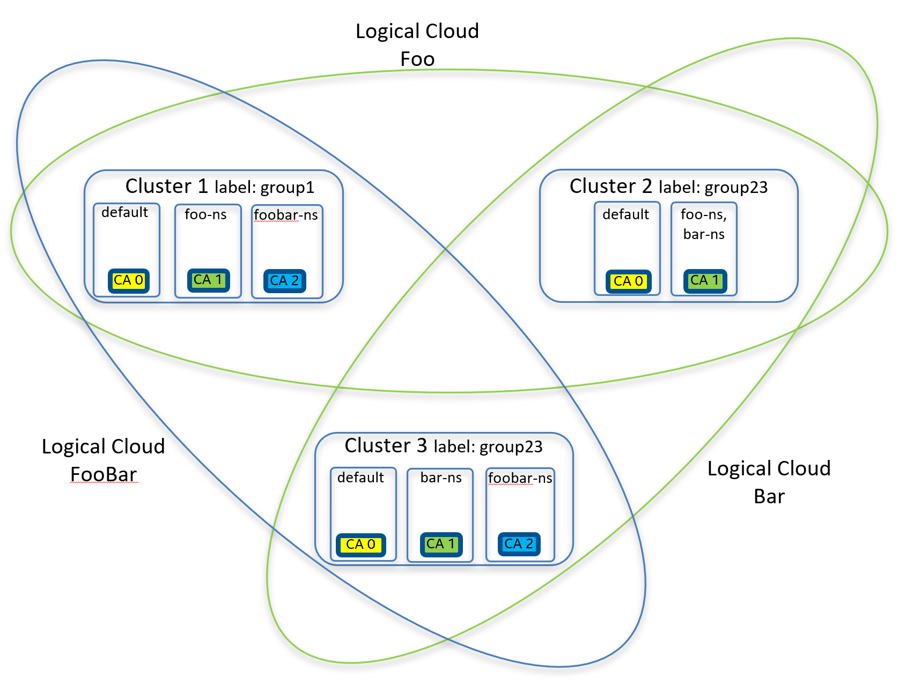

#### SPDX-License-Identifier: Apache-2.0
#### Copyright (c) 2022 Intel Corporation

# Running the EMCO CA Certificate Distribution example

This folder contains an example of the CA Certificate Distribution feature.  It provides examples of both the
`cluster-provider` and `logical-cloud` based forms of CA Certificate Distribution.

The `cluster-provider` variant of CA Certificate Distribution configures the default Istio CA certificates of a set of
clusters under a specified `cluster-provider` to all have a common CA root chain, as provided by the administrator.

The `logical-cloud` variant allows a set of clusters associated with one or more Logical Clouds to have a common CA root chain.

The following diagram illustrates the end state of this example if both variants are applied.



The diagram illustrates that three edge clusters are used.   The `cluster-provider` variant will distribute the `CA 0` certificates
as the default Istio CA for all three clusters.

Logical clouds `Foo` and `Bar` are both specified in the `logical-cloud` variant for `CA 1`.  As a result the namespaces `foo-ns`
`bar-ns` in all three clusters will be configured to have the common CA `CA 1`.  (note each cluster will have a common root but
its own Intermediate CA certificate).

Logical cloud `FooBar` is specified to use `CA 2` and results in namespace `foobar-ns` on Cluster1 and Cluster3 to be configured with CA certificates for `CA 2`.

# Environment Setup and Assumptions

## Issuing Cluster setup

An issuing cluster is assumed to be configured by the administrator.  A cert-manager ClusterIssuer needs to be configured for
each CA root chain that will serve as a source for CA Certificate Intents.  This example will expect three ClusterIssuers to be
configured to provide the Intermediate CA Certs for `CA 0`, `CA 1` and `CA 2`.

### Installing cert-manager on the Issuing Cluster

Install cert-manager on the Issuing Cluster.  Following is an example sequence for installing cert-manager.
Note, that if the Issuing Cluster will also function as an Edge Cluster (perhaps in a development setup), then cert-manager
must be installed as described below in the [Installing Istio on the Edge Clusters](#installing-istio-on-the-edge-clusters) section.

```
helm repo add jetstack https://charts.jetstack.io
helm repo update
helm install cert-manager jetstack/cert-manager --namespace cert-manager --create-namespace --set installCRDs=true
```

Once cert-manager is installed, run the script [setup-ca-issuers.sh](ca-certs/setup-ca-issuers.sh) to generate the needed
ClusterIssuers (and associated resources).

## Edge Cluster Setup

The EMCO CA Certificate Distribution example currently supports distributing and configuring CA Certificates to clusters where
Istio has been configured to use cert-manager as an external certificate signer.  This requires cert-manager and Istio to be
installed with specific features enabled and/or configured.

Edge clusters which have been setup to satisfy these requirements will be labeled by EMCO `clm` (in the example).  These labels
can then be specified in the CA Cert Intents to identify the clusters which will be covered by the Intents (i.e. get configured
with CA Certificates).

### Installing cert-manager on the Edge Clusters

Install cert-manager as follows:

```
helm repo add jetstack https://charts.jetstack.io
helm repo update
helm install cert-manager jetstack/cert-manager --namespace cert-manager --create-namespace --set featureGates="ExperimentalCertificateSigningRequestControllers=true" --set installCRDs=true
```

### Installing Istio on the Edge Clusters

Install the Istio `istioctl` program.  See [Istio Getting Started](https://istio.io/latest/docs/setup/getting-started/#download) for details on how to do this.

Then execute the script [setup-edge-cluster-istio.sh](ca-certs/setup-edge-cluster-istio.sh).  This will setup a default cert-manager
ClusterIssuer for Istio and generate a yaml file (`istio-install.yaml`)for installing Istio.

Then run:

```
istioctl install -y -f istio-install.yaml
```

### Installing KNCC on the Edge Clusters

KNCC is a component which allows EMCO to update the Istio configmap on the Edge Cluster via a Cluster Resource managed by KNCC.
KNCC can be found here:  [KNCC](https://gitlab.com/project-emco/ecosystem/k8sappconfig/-/tree/master/kncc) and instructions for
building and installing KNCC can be found here: [Build and Deploy KNCC](https://gitlab.com/project-emco/ecosystem/k8sappconfig/-/tree/master/kncc/docs)

### Configuring SGX on the edge cluster - proof of concept (POC)

Please follow the official Intel SGX documentation for configuring and enabling SGX. We need the trusted attestation controller and trusted certificate services running on the edge cluster to provision a certificate securely using SGX.

 - [SGX](https://www.intel.com/content/www/us/en/developer/tools/software-guard-extensions/get-started.html)
 - [Intel SGX SDK for Linux](https://www.intel.com/content/www/us/en/developer/tools/software-guard-extensions/get-started.html)
 - [Intel SGX Developer Guide](https://download.01.org/intel-sgx/latest/linux-latest/docs/Intel_SGX_Developer_Guide.pdf)
 - [Intel SGX SW Installation Guide for Linux](https://download.01.org/intel-sgx/latest/linux-latest/docs/Intel_SGX_SW_Installation_Guide_for_Linux.pdf)
 - [Intel Trusted Attestation Controller](https://github.com/intel/trusted-attestation-controller)
 - [Intel Trusted Certificate Issuer](https://github.com/intel/trusted-certificate-issuer)

### Setting up the Key Management Reference Application (KMRA) server

Please follow the official Intel [KMRA](https://www.intel.com/content/www/us/en/developer/topic-technology/open/key-management-reference-application/overview.html) documentation for configuring and enabling KMRA. For this POC, we used the KMRA version 2.0. We have the KMRA server and the [issuing cluster](#issuing-cluster-setup) set up on the same server for managing the intermediate certificates and the key. We use the sample keygen utility to import the keys into the KMRA server. We use a [script](https://gitlab.com/project-emco/core/emco-base/-/blob/main/examples/test-cert/ca-certs/keygen.sh), which runs in the background, to check for any cert-manager certificate resources. It retrieves the certificate and the key from the corresponding secret and imports them into the KMRA server. 
> **NOTE**: The script is for demonstration purposes only. For a production environment, please protect all the certificates and keys and import them securely into the KMRA server.

# Running the examples

## Setup Test Environment to run test cases

The `setup.sh` script is available to create the `values.yaml` and `emco-cfg.yaml` files to use with `emcoctl`.

The following environment variables are expected to be set before running `setup.sh`:

  - ``HOST_IP``: IP address of the cluster (or machine) where EMCO is installed
  - ``KUBE_PATH_ISSUING``: points to where the kubeconfig for the edge cluster is located
  - ``KUBE_PATH1``: points to where the kubeconfig for the edge cluster 1 is located
  - ``KUBE_PATH2``: points to where the kubeconfig for the edge cluster 2 is located
  - ``KUBE_PATH3``: points to where the kubeconfig for the edge cluster 3 is located

Then run the script:

```
$ ./setup.sh create
```

Output files of this command are:
* ``values.yaml``: specifies useful variables for the creation of EMCO resources
* ``emco_cfg.yaml``: defines the deployment details of EMCO (IP addresses and ports of each service)

To removes the artifacts previously generated, run the following:

```
$ ./setup.sh cleanup
```

> **NOTE**: Please make the following changes if you have a cluster with the SGX enabled and need to test the SGX capabilities.
  - In the prerequisites.yaml file, add a key-value pair for the cluster with sgx enabled.
    ```
      version: emco/v2
      resourceContext:
        anchor: cluster-providers/{{.ClusterProvider}}/clusters/{{.Cluster1}}/kv-pairs
      metadata :
        name: "sgx"
      spec:
        kv:
          - enabled: "true"
    ```
  - Modify the emco monitor configmap `monitor-monitor-list` on the edge cluster and issuing cluster to include the `Secret` and `Certificate` resources.
    ```
      apiVersion: v1
      data:
        gvk.conf: |
          [
            {"Group": "k8s.plugin.opnfv.org", "Version": "v1alpha1", "Kind": "Network", "Resource": "networks" },
            {"Group": "rbac.authorization.k8s.io", "Version": "v1", "Kind": "ClusterRole", "Resource": "clusterroles"},
            {"Group": "cert-manager.io", "Version": "v1", "Kind": "CertificateRequest", "Resource": "certificaterequests"},
            {"Group": "networking.istio.io", "Version": "v1beta1", "Kind": "ProxyConfig", "Resource": "proxyconfigs"},
            {"Group": "cert-manager.io", "Version": "v1", "Kind": "ClusterIssuer", "Resource": "clusterissuers"},
            {"Version": "v1", "Kind": "Secret", "Resource": "secrets"},
            {"Group": "cert-manager.io", "Version": "v1", "Kind": "Certificate", "Resource": "certificates"}
          ]
      kind: ConfigMap
      metadata:
        name: monitor-monitor-list
        namespace: default
    ```
  - Verify [keygen](https://gitlab.com/project-emco/core/emco-base/-/blob/main/examples/test-cert/ca-certs/keygen.sh) script is running on the cluster where the KMRA server is running.
    - The script updates the apphsm.conf file in /opt/intel/apphsm/apphsm.conf every time a new secret gets generated by a certificate resource
    - It invokes the sample keygen utility to import the keys into the apphsm. Use the `softhsm2-util --show` to list the keys.
  - Verify trusted attestation controller and trusted certificate service are running on the edge cluster.
    ```
      kubectl get po -n tcs-issuer
      NAME                              READY   STATUS    RESTARTS   AGE
      tcs-controller-6f4fd7849c-lm7vc   1/1     Running   0          3d1h

      kubectl get po -n attestation-controller
      NAME                       READY   STATUS    RESTARTS   AGE
      tac-app-867b9b77c5-hm5zs   2/2     Running   0          3d1h
    ```
  
## Description of the example resource files

* ``prerequisites.yaml``: defines basic EMCO resources and onboards and labels the three clusters for the example

* ``ca-cert-cluster-provider.yaml``: defines the CA Cert Intents for the `cluster-provider` variant

* ``ca-cert-cluster-provider-enrollment.yaml``: defines the enrollment command for the CA Cert Intents for the `cluster-provider` variant

* ``ca-cert-cluster-provider-distribution.yaml``: defines the distribution command for the CA Cert Intents for the `cluster-provider` variant

* ``logical-clouds.yaml``: defines the resources for the three standard Logical Clouds of the example:  `Foo`, `Bar` and `FooBar`

* ``logical-clouds-instantiate.yaml``: defines the instantiate commands for the three standard Logical Clouds of the example

* ``ca-cert-logical-clouds.yaml``: defines the CA Cert Intents for the `logical-cloud` variant

* ``ca-cert-logical-clouds-enrollment.yaml``: defines the enrollment commands for the two CA Cert Intents of the `logical-cloud` variant examples

* ``ca-cert-logical-clouds-distribution.yaml``: defines the distribution commands for the two CA Cert Intents of the `logical-cloud` variant examples

## Apply prerequisites first
Apply prerequisites.yaml. This is required for both CA Cert Intent variants. This creates controllers, one project, three clusters.

```
$ emcoctl --config emco-cfg.yaml apply -f prerequisites.yaml -v values.yaml
```

## Apply the `cluster-provider` variant

Apply the `cluster-provider` variant resource files to configure the default CA certs for the three clusters.

```
$ emcoctl --config emco-cfg.yaml -v values.yaml apply -f ca-cert-cluster-provider.yaml
$ emcoctl --config emco-cfg.yaml -v values.yaml apply -f ca-cert-cluster-provider-enrollment.yaml
$ emcoctl --config emco-cfg.yaml -v values.yaml apply -f ca-cert-cluster-provider-distribution.yaml
```

To terminate and delete run the following commands.  Note, this will also unconfigure the CA Certs in the clusters.

```
$ emcoctl --config emco-cfg.yaml -v values.yaml delete -f ca-cert-cluster-provider-distribution.yaml -w 5
$ emcoctl --config emco-cfg.yaml -v values.yaml delete -f ca-cert-cluster-provider-enrollment.yaml -w 5
$ emcoctl --config emco-cfg.yaml -v values.yaml delete -f ca-cert-cluster-provider.yaml
```

## Apply the `logical-cloud` variant

First, the logical clouds need to be created.

```
$ emcoctl --config emco-cfg.yaml -v values.yaml apply -f logical-clouds.yaml
$ emcoctl --config emco-cfg.yaml -v values.yaml apply -f logical-clouds-instantiate.yaml
```

Apply the `logical-cloud` variant resource files to configure the two CA cert intents for the three logical clouds.

```
$ emcoctl --config emco-cfg.yaml -v values.yaml apply -f ca-cert-logical-cloud.yaml
$ emcoctl --config emco-cfg.yaml -v values.yaml apply -f ca-cert-logical-cloud-enrollment.yaml
$ emcoctl --config emco-cfg.yaml -v values.yaml apply -f ca-cert-logical-cloud-distribution.yaml
```

To terminate and delete run the following commands.  Note, this will also unconfigure the CA Certs in the clusters.

```
$ emcoctl --config emco-cfg.yaml -v values.yaml delete -f ca-cert-logical-cloud-distribution.yaml -w 5
$ emcoctl --config emco-cfg.yaml -v values.yaml delete -f ca-cert-logical-cloud-enrollment.yaml -w 5
$ emcoctl --config emco-cfg.yaml -v values.yaml delete -f ca-cert-logical-cloud.yaml
```

Now, the logical clouds can be terminated and deleted.

```
$ emcoctl --config emco-cfg.yaml -v values.yaml delete -f logical-clouds-instantiate.yaml -w 5
$ emcoctl --config emco-cfg.yaml -v values.yaml delete -f logical-clouds.yaml
```


## Clean up the prerequisites

```
$ emcoctl --config emco-cfg.yaml -v values.yaml delete -f prerequisites.yaml
```
