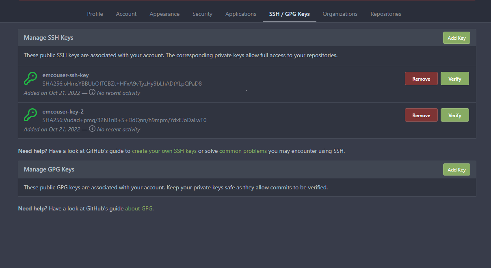

[//]: # "SPDX-License-Identifier: Apache-2.0"
[//]: # "Copyright (c) 2022 Intel Corporation"

# Setting up a local Gitea Server
Using the script provided in this folder a local Gitea server can be installed.

## Setup Environment Variable

Export `HOST_IP`: IP address of the cluster where gitea is to be installed.

## Creating a User

The gitea server comes with a default administrator username and password. We can create additional users using the script.

To create a new user we use the `create_user` option. With this option, when the script is run, it prompts the user for his or her `UserName`, `Email` address, and `Password`. A unique user gets created and an access URL is shown if there are no errors. The URL consists of the `HOST_IP` which was set earlier and a service node port. Additionally, a DNS name could also be assigned to the URL (outside the scope of this example).

Example user creation,
```
~/emco-base/examples/test-gitea$ ./gitea.sh create_user
UserName: emcouser
Email: emcouser@email.com
Password: <Enter Password>

New user Created! Access using URL:  http://$HOST_IP:<service port>

```

## Creating a Repository for an existing User

We can create repositories for existing users using the script.

To create a new repository for an existing user we use the `create_repo` option. This option prompts the user for his or her `UserName`, `Password`, and `RepoName` (Name of the new repository to be created). If there are no errors, the repository is created and an access URL is displayed. This URL is similar to the one mentioned above in the "Creating a User" section.

Example repository creation for a user created in the above section.

```
~/emco-base/examples/test-gitea$ ./gitea.sh create_repo
UserName: emcouser
Password: <Enter Password>
RepoName: test-repo

New Repo Created! Access using URL:  http://$HOST_IP:<service port>

```

## Accessing the Git repository

The created repository can be accessed using the gitea URL obtained on user and repo creation.

### Login Page
User can login to their account using the `UserName` and `Password` set during the creation of the user.


### Repository Page
Repository is created for the user with a default README.md.


## Uploading SSH Key

In order to connect to the gitea server through `SSH`, the user must upload the `SSH` public key to the server. These keys must be unique for each user. The script can upload existing keys as well as create and upload new keys to the gitea server using the `upload_key` option.

### Create New key and upload to gitea server

```
vagrant@emco:~/git/go/src/EMCO_LAB_MAIN/emco-base/examples/test-gitea$ ./gitea.sh upload_key
UserName: emcouser
KeyName: emcouser-ssh-key
Create New Key (y/N) y
New Key FilePath: /home/vagrant/.ssh

Generating public/private rsa key pair.
<Output from SSH Key creation>
Your identification has been saved in /home/vagrant/.ssh/emcouser-ssh-key
Your public key has been saved in /home/vagrant/.ssh/emcouser-ssh-key.pub

Public Key uploaded for User:  emcouser

```
`UserName` is the unique user name, `KeyName` is the name we want to store the ssh public key in Gitea, and to create a new SSH key pair, input `y` to the `Create New Key` option. In the `New Key FilePath` option, specify the path to the system where the keys should be stored. The script will use the key name provided in the `KeyName` step to generate the private-public key pair. Once the keys are generated they are uploaded to the gitea server.

### Upload existing key to the gitea server

```
vagrant@emco:~/git/go/src/EMCO_LAB_MAIN/emco-base/examples/test-gitea$ ./gitea.sh upload_key
UserName: emcouser
KeyName: emcouser-key-2
Create New Key (y/N) N
Key FilePath: /home/vagrant/.ssh/emcouser-key.pub

Public Key uploaded for User:  emcouser
```
To upload an existing ssh public key input `N` to the `Create New Key` option. In the `New Key FilePath` provide the path to the existing ssh public key, the script will then upload the public key to the gitea server.

### SSH keys Page
Both keys uploaded are uploaded to the gitea server for user `emcouser`.


## Gitea with Istio

To use Istio with Gitea, follow the steps mentioned in https://gitlab.com/project-emco/core/emco-base/-/blob/main/docs/design/dtc_istio_support.md to install and setup Istio. Once Gitea is depolyed with the Istio side cars apply emco-virtualservices.yaml from https://gitlab.com/project-emco/core/emco-base/-/blob/main/scripts/samples/istio/emco-virtualservices.yaml . With the gitea-istio.sh script, follow the steps above to set up the user, repo, and upload key. This script uses the istio-ingressgateway ip and ports for interacting with gitea.