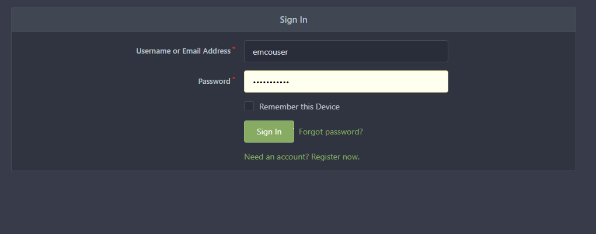
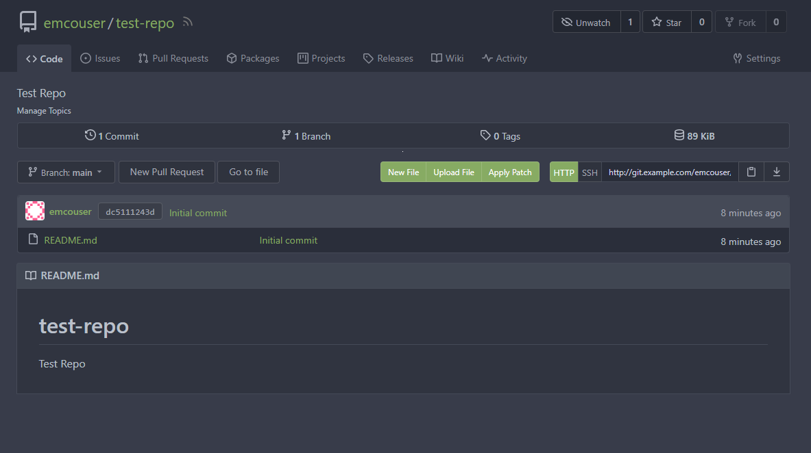

[//]: # "SPDX-License-Identifier: Apache-2.0"
[//]: # "Copyright (c) 2022 Intel Corporation"

# Setting up a local Gitea Server
Using the script provided in this folder a local Gitea server can be installed.

## Setup Environment Variable

Export `HOST_IP`: IP address of the cluster where gitea is to be installed.

## Creating a User

The gitea server comes with a default administrator username and password. We can create additional users using the script.

To create a new user we use the `create_user` option. With this option, when the script is run, it prompts the user for his or her `UserName`, `Email` address, and `Password`. A unique user gets created and an access URL is shown if there are no errors. The URL consists of the `HOST_IP` which was set earlier and a service node port. Additionally, a DNS name could also be assigned to the URL (outside the scope of this example).

Example user creation,
```
~/emco-base/examples/test-gitea$ ./gitea.sh create_user
UserName: emcouser
Email: emcouser@email.com
Password: <Enter Password>

New user Created! Access using URL:  http://$HOST_IP:<service port>

```

## Creating a Repository for an existing User

We can create repositories for existing users using the script.

To create a new repository for an existing user we use the `create_repo` option. This option prompts the user for his or her `UserName`, `Password`, and `RepoName` (Name of the new repository to be created). If there are no errors, the repository is created and an access URL is displayed. This URL is similar to the one mentioned above in the "Creating a User" section.

Example repository creation for a user created in the above section.

```
~/emco-base/examples/test-gitea$ ./gitea.sh create_repo
UserName: emcouser
Password: <Enter Password>
RepoName: test-repo

New Repo Created! Access using URL:  http://$HOST_IP:<service port>

```

## Accessing the Git repository

The created repository can be accessed using the gitea URL obtained on user and repo creation.

### Login Page
User can login to their account using the `UserName` and `Password` set during the creation of the user.


### Repository Page
Repository is created for the user with a default README.md.
