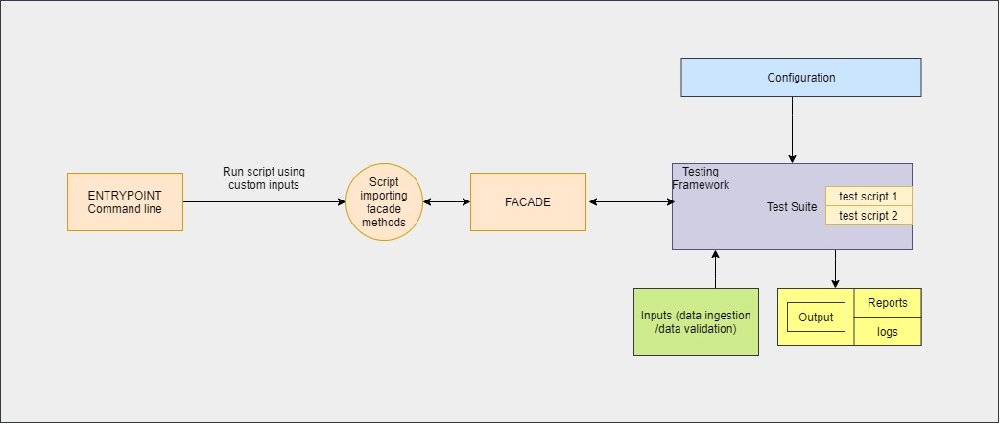

# EMCO API Test Automation

## FAQ / TOC :

1. What is the EMCO API Test Automation Framework? [jump to](#introduction)
2. What is the Automation Framework's architecture? [jump to](#architecture)
3. How to configure the framework?  [jump to](#configuration)
4. How to run the test automation? [jump to](#run)
5. How to check logs? [jump to](#logs)
6. How to check test reports? [jump to](#reports)


## 1. Introduction<a name="introduction"></a>

EMCO API Test Automation Framework is a project which runs automated executions of Test Cases for all EMCO APIs.


## 2. Architecture<a name="architecture"></a>



 - automation_facade: It is the main entry point of the application where all the services are imported and executed.
 - deps: It contains the test executor service.
 - utils: It contains all the helper functions.
 - report_generator: It is a module that generates HTML reports of automation runs.
 - env_config: It contains all the configurations required to run the automation application.
 - test_suite: It contains all the *pytest* test scripts.
 - inputs: It contains all the data for API payload and response validation.
 - outputs: It contains the logs and reports.
 - test_list: It contains the sequence of test cases to be executed.


## 3. EMCO Automation Configuration<a name="configuration"></a>

The configuration folder contains two files.

 - `.env`: It is the environment variable file where you can configure the host and port information. Example:
	```
	HOST='192.168.121.18'
	ORCHESTRATOR_PORT='30415'
	CLM_PORT='30461'
	NCM_PORT='30481'
	OVNACTION_PORT='30451'
	DCM_PORT='30477'
	GAC_PORT='30420'
	DTC_PORT='30418'
	HPA_PORT='30491'
	KUBECONFIG_PATH='/home/vagrant/.kube'
	```


	> Update HOST to EMCO Host IP address, where the EMCO services are reachable.

	> All variables need to be defined.

 - `env_config.py` (*python syntax*):
		 It contains all application level configuration. Example:

	    INPUT_BASE = os.path.join('inputs', 'data')
    	TEST_SUITE_BASE = os.path.join('test_suite')
    	LOG_PATH = os.path.join('outputs', 'logs')
    	LOG_LEVEL = 'DEBUG'
    	HELM_CHART_FOLDER_PATH = os.getcwd() + os.path.sep + 'tgz_files'
    	BASE_COMMAND = 'python -m pytest --disable-pytest-warnings -s'
    	COMMAND_EXEC_TIMEOUT = 20
    	TEST_REPORT_FILE_PREFIX = 'test_report_'


## 4. Running EMCO API test automation<a name="run"></a>

To trigger full API automation testing:

 1. Install Python version 3.8 or above.
 2. Install all required python dependencies present in the `requirements.txt` file by running:

	    $ pip install -r requirements.txt

 3. Modify the `configuration/.env` file according to the running EMCO environment (as explained in  [Point 3](#configuration)).

 4. Run the following command to set up and create binaries in `tgz_files/`:

	    $ ./setup.sh create
	**Optional**:
		If you do not want to use shell script then follow these steps:

	1. Copy binaries (`monitor.tar.gz`,  `operator_profile.tar.gz`) to `tgz_files/` folder.
	2. Create `.env` file in configuration folder.

 5. Run:

	    $ python test_client.py

**Optional method (using virtual environment):**
The framework also contains *pipenv* configuration (*pipenv* is a python virtual environment tool):

1. `$ pip install pipenv`
2. `$ pipenv --python 3.8`
3. `$ pipenv shell`
4. `$ pipenv install`
5. `$ python test_client.py`

> The framework also contains another test sequence, Cleanup Automation, which can be run using `$ python cleanup_client.py`.
> These Test sequences can be added and updated in the `test_list.py` file.


## 5. EMCO API test automation logs<a name="logs"></a>

The logs are saved in `outputs/logs` folder.


## 6. EMCO API test automation reports<a name="reports"></a>

The logs are saved in `outputs/reports` folder.
